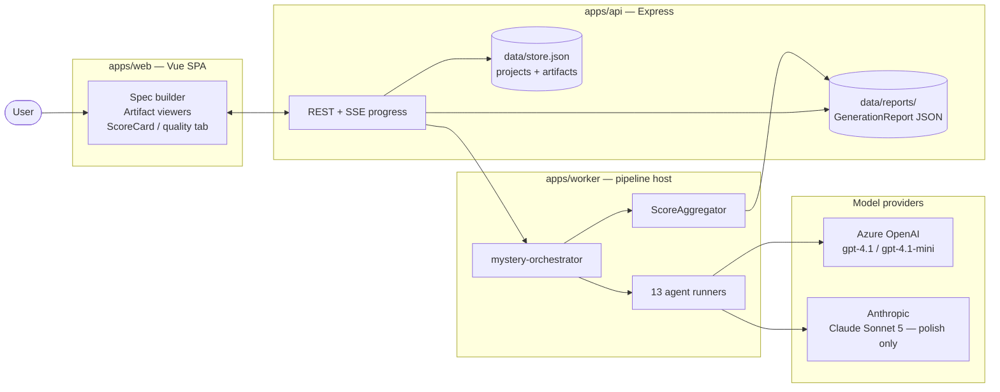
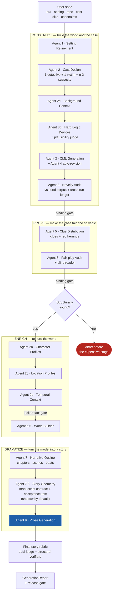
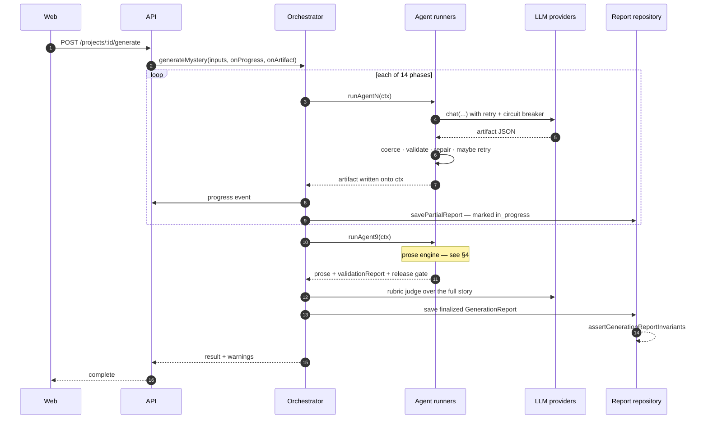
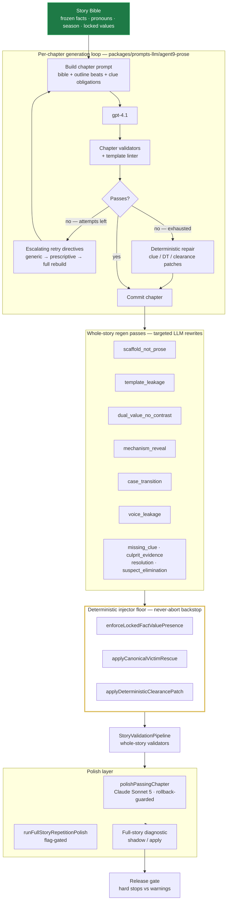
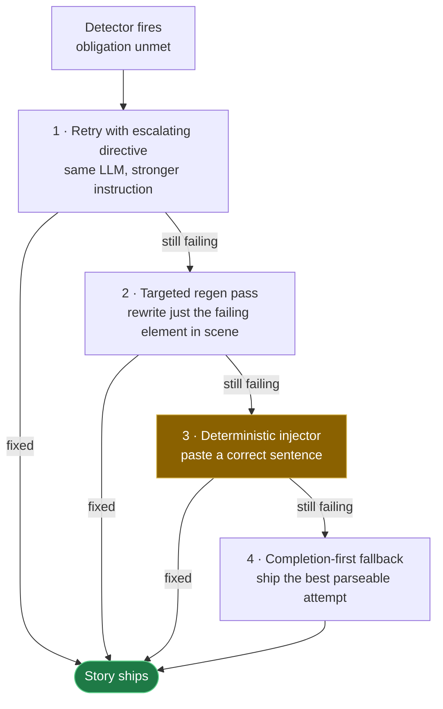
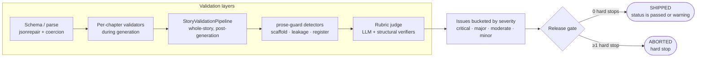
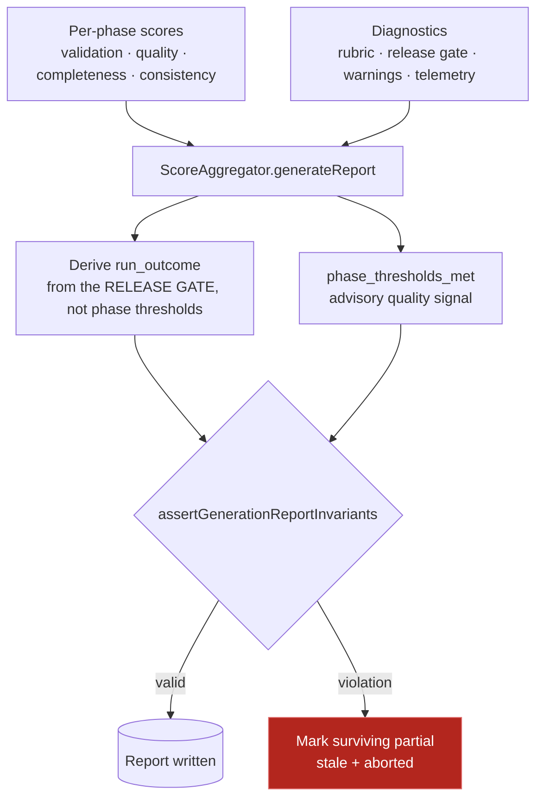
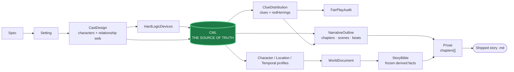
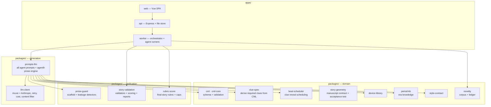
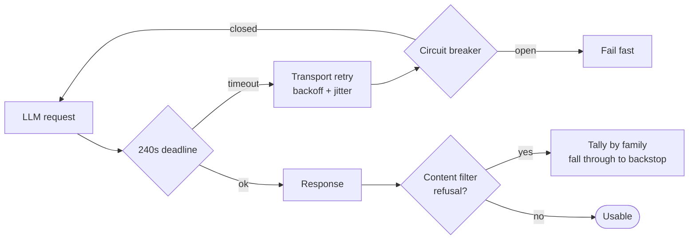

# Story Generation — End-to-End Architecture

**Scope:** the whole path from a user's spec to a shipped Golden-Age whodunit, plus the validation, repair, and measurement layers wrapped around it.

**Audience:** someone who needs a working mental model of the system before touching it. This is the map, not the territory — where a detail is load-bearing, the file is linked.

**Status:** written 2026-08-01 against the pipeline at `redesign/agent-blue-sky`. Phase order and stage names are taken from the orchestrator and from real run reports, not from prior docs.

---

## 0. The one-sentence version

> A CML model — the case's formal logic — is constructed and proved first; prose is a *rendering* of that model, and everything downstream of generation exists to detect and repair the gap between what the model says and what the prose actually put on the page.

Three properties follow from that, and most of the architecture is a consequence of one of them:

| Property | What it forces |
|---|---|
| **Logic before prose** | 13 upstream stages run before a word is written. A structurally unsound case is aborted *before* the expensive stage. |
| **Never abort a shippable story** | Every prose defect has a repair ladder ending in a deterministic floor. The release gate degrades; it does not fail. |
| **Detect, don't hope** | A craft fix without a detector doesn't stick; a detector without a verified read path is worse than no number. |

---

## 1. System context

`apps/worker` is where all generation happens; the API is a thin control and read surface. There is no queue — a run is an in-process async call with a progress callback.

---

## 2. The end-to-end pipeline

Fourteen scored phases. The order below is the orchestrator's actual call sequence ([mystery-orchestrator.ts:917-1230](../apps/worker/src/jobs/mystery-orchestrator.ts#L917)); the phase names match what lands in the report.

### Why this order

- **Cast before CML.** Agent 3 needs a fixed cast to assign roles and culpability against; the role model — one detective, one victim, the rest suspects — is what closes the "victim is alive in chapter 6" defect class at the source.
- **Devices before CML.** Agent 3b invents the *mechanism* (how the impossible thing happened) and runs a plausibility judge over it; Agent 3 then builds the formal case around an already-vetted mechanism.
- **Novelty immediately after CML.** The audit compares the case skeleton against the seed corpus and the cross-run ledger. Catching a retread here costs one stage; catching it after prose costs a whole run.
- **Clues and fair-play before profiles.** Both binding gates and the early structural abort sit here. Everything after this line is expensive, so the last cheap opportunity to stop is used.
- **Profiles and world building before the outline.** Agent 7 schedules clue reveals against scenes; it needs the locations, the character voices, and the timeline to exist first.

### The three gates before prose

| Gate | Fires when | Behaviour |
|---|---|---|
| Novelty binding gate | Agent 8 blocking | Abort unless `forceWarnings` |
| Fair-play binding gate | Agent 6 blocking | Abort unless `forceWarnings` |
| Early structural abort | CML/coverage unsound | Always aborts — refuses to spend Agent 9 on an unsound case |

---

## 3. A single run, in sequence

Two things worth noticing:

1. **Partial reports are written throughout.** They exist so the UI can poll a live run. Since A_71 they are stamped `run_outcome: "in_progress"`, `passed: false` at write time — an unfinished snapshot can never be mistaken for a verdict, however the process dies.
2. **`save()` asserts invariants.** A contradictory report is not written at all. That is a strong guarantee and also a sharp edge: an over-strict invariant silently costs you the entire report ([the A_71 §1 defect](../documentation/analysis/ANALYSIS_71/ANALYSIS_71.md)).

---

## 4. Agent 9 — the prose engine

The other twelve agents each make roughly one LLM call and validate the result. Agent 9 is a pipeline in its own right, and most of the system's complexity lives here.

### The Story Bible

Built before generation and treated as authoritative for the run. Its purpose is to stop validators *re-deriving* facts they should be *dereferencing* — the root cause behind the season-lock and locked-fact defect families. When a validator asks "what season is it?", the answer comes from the bible, not from re-reading the prose.

### Ordering is load-bearing here

Three separate boards were spent on fixes aimed at the wrong layer. The rule the diagram encodes:

> **Prose keeps changing after `generateProse()` returns.** The regen passes, the deterministic injectors, and the pronoun sweeps all run in `agent9-run.ts`, *after* the package-level generation is done.

A polish prompt instructed to remove a phrase that a later injector has not yet inserted does nothing. The full-story diagnostic was originally wired inside `generate.ts` and pointed at text that never shipped — anchor rate 60%; moved to the ship layer it went to 100%.

---

## 5. The repair ladder

The single most repeated pattern in the system. Every content obligation — a clue must be planted, a suspect must be cleared, a locked value must appear — descends this ladder until something works.

**The tension this encodes:** level 3 buys correctness at direct cost to prose quality. A deterministic paste always satisfies the validator and always reads like a machine — the injected clearance sentences are exactly what external reviewers flag as "generated validation prose". Levels 1 and 2 produce better prose but can fail; level 3 cannot fail.

The strategic direction is therefore: **push work up the ladder** — prefer an LLM rewrite that keeps the content but reads as fiction, with the deterministic string retained as the validate-then-rollback floor. That is what the `AGENT9_REGEN_*` flags do, one obligation at a time.

Two traps this ladder has sprung, both worth knowing before adding a rung:

- An injector at level 3 may live in a *different package* from the one you are measuring. The clearance prose has two independent injectors — one in `agent9-run.ts`, one in `deterministic-repair.ts` — and measuring one cleared both.
- A level-3 paste that reads well but fails the linter is worse than the flat one it replaced. The floor's job is to satisfy the gate.

---

## 6. Validation and the release gate

`StoryValidationPipeline` composes the whole-story validators — encoding, character consistency, character *lifecycle* (the dead-victim-acts family), prose consistency, narrative continuity, discriminating test, suspect closure, physical plausibility, and more.

**The pinned definition of SHIPPED** is `release_gate_outcome.status ∈ {passed, warning}` — a scored gate with zero hard stops. Warnings mean *needs review*, not *failed*: the story exists and was scored. Since A_71 this is computed once as `release_gate_outcome.shipped` rather than re-derived by each consumer, because two hand-copies of that rule had drifted apart.

---

## 7. Scoring and reporting

Two rules that are easy to get backwards:

1. **`run_outcome` is a ship signal, not a quality verdict.** Gate shipped ⇒ `passed`, regardless of whether every phase met its threshold. The phase verdict lives separately in `phase_thresholds_met`. Conflating them is what made 21 shipped runs read "failed" in every corpus scan.
2. **Never read a persisted report without checking `in_progress` / `stale` / `incomplete`.** The API read path corrects stale snapshots automatically; direct file readers do not. `scripts/target80-ledger-row.mjs` refuses to score a partial for exactly this reason.

Cost is audited from `logs/llm-prompts-full.jsonl`, never from `report.total_cost`.

---

## 8. Data model — what flows between stages

**CML is the single source of truth.** Everything downstream is either derived from it or validated against it. The `CASE` object carries the cast, the hidden model (culprit, mechanism, true and staged times), the inference path, and the locked facts. Prose is the last artifact and the only one the user normally sees.

**The Story Bible is the freeze point.** Facts derived once, then dereferenced rather than re-derived.

---

## 9. Package map

> **Build trap:** the worker consumes `@cml/*` via **dist**, not src. Vitest runs against src, so green tests do not mean the worker sees your change. Run `npm run build:all` and verify with `scripts/preflight-dist-check.mjs` before any probe.

---

## 10. Cross-cutting concerns

### Feature flags — the corpus-era regime

Behaviour levers ship **flag-gated, default-OFF**, and are promoted only after a powered A/B. Three rules, each earned the hard way:

- **Runtime getters, never module consts.** A `const FLAG = process.env.X` at module scope is frozen before dotenv loads, so the flag silently never fires.
- **Verify a lever fired by its agent label** in `llm-prompts-full.jsonl` — not by grep, and not by assuming.
- **One flag per A/B arm.** Bundling two levers reintroduces the confound the harness exists to remove.

A/Bs replay Agent 9 over a prior run's hydrated upstream artifacts, so each pair is matched by construction on chapter count and opening naming — the two factors that otherwise dominate any single-run comparison. Minimum pool: 4 runs.

### Reliability

Retry lives at the client choke point so every call site inherits it — 23 pipeline call sites use `chat()` directly, and for a long time only three of them had any retry at all.

### Telemetry

Chain logs die with the terminal; **the report is the durable record**. Everything a run learns — full warnings array, per-phase diagnostics, rubric caps, clue visibility, content-filter refusals, clearance-paste counts, phrase telemetry — is written into the `GenerationReport`. A detector without a read path into that artifact produces a number nobody can act on.

---

## 11. Where the bodies are buried

Short list of traps that have each cost more than one debugging session.

| Trap | Symptom | Guard |
|---|---|---|
| Worker reads stale dist | Fix "doesn't work" but tests are green | `npm run build:all` + `preflight-dist-check.mjs` |
| Module-const flag | Lever never fires, no error | Runtime getter; verify by agent label |
| Shape mismatch on LLM JSON | Detector silently returns 0 forever | Check the read path against a **real artifact**, not the declared contract |
| camelCase vs snake_case cast fields | Detective/victim filter silently no-ops | Read `role_archetype ?? roleArchetype ?? role` |
| Fix aimed at a layer that runs too early | Prose keeps changing after the fix point | Wire ship-layer passes in `agent9-run.ts`, not `generate.ts` |
| One defect, several bodies | Measuring one module clears all of them | Count at the shared choke point |
| Trusting `report.total_cost` | ~5–7× under-reported | Audit from `llm-prompts-full.jsonl` |
| Reading a persisted report raw | "96 / A / passed" for a run that scored 66 | Check `in_progress` / `stale` / `incomplete` first |

---

## 12. Related documentation

### In this folder

Written after this map (2026-08-01) and, where they conflict with it, **newer**:

| Doc | What it holds |
|---|---|
| [REVIEW_01](REVIEW_01.md) | The remediation plan and build record (R- and S-series) |
| [REVIEW_02](REVIEW_02.md) | Audit of that build **against the wire** — found R3/R4 non-functional, R8 unmeasurable |
| [REVIEW_03](REVIEW_03.md) | Position statement after two live runs. **§0m is the freshest state of the system** |
| [REVIEW_04](REVIEW_04.md) | The geometry work, and the four defects it uncovered |
| [REVIEW_05](REVIEW_05.md) | The deep record and the progress tracker — every item, with its § |
| [REVIEW_06](REVIEW_06.md) · [REVIEW_07](REVIEW_07.md) · [REVIEW_08](REVIEW_08.md) | Successive orderings of the board on the path from 80 to 90 |
| [REVIEW_09](REVIEW_09.md) | The machinery is finished; the instruments and the case are not. Five reads, and the free block as built |
| [REVIEW_10](REVIEW_10.md) | The live board, one row per agent — and the 86 run that already hit best-ever in all ten categories |
| [REVIEW_11](REVIEW_11.md) | The M6 probe's cold read: 86 again from a different shape, dialogue's first 8 in 33 reads, and five reader complaints traced to the log |
| [REVIEW_12](REVIEW_12.md) | Why there are so many retries: 0.50 per chapter and 37% of all prose prompt volume. The largest measured cause is one word — the case's own "broken spring fragment" read as the season — plus a chapter whose outline instructs what its validator forbids |
| [REVIEW_13](REVIEW_13.md) | The open board and the arithmetic of the target: best-ever in all ten categories sums to 84 and projects to 87, so 90 needs two to three marks no read has ever given. §8 adds the deterministic read of the 08-19 manuscript |
| [REVIEW_14](REVIEW_14.md) |  The path to 90 after auditing the instruments rather than the prose: five defects in one day, none of them the model. The prose prompt is 48.4% reference and 12.6% craft — and craft is dropped first — while the categories stuck at 8 are the craft ones |
| [REVIEW_15](REVIEW_15.md) | The 08-19 read came back at 81, and four of its six complaints had already been detected, named and reported by the pipeline before it shipped. Geometry violations are warning-only by construction: mojibake stops a run, "the reveal never names the culprit" does not |
| [PLAN-TO-90](PLAN-TO-90.md) | **Start here.** The plan, and the finding that reorders it: no instrument in this project can tell an 86 from an 81 — headline, prose phase and shadow rubric all rank the two backwards. "90 every run" asks the WORST future run to beat the best ever recorded by four marks. Phase 0 builds a gauge; Phases 1–3 are only meaningful after it. Supersedes the orderings in REVIEW_13/14/15 |
| [REMEDIATION-ALL-AXES](REMEDIATION-ALL-AXES.md) | The defect backlog, with an axis dimension. **52% of shipped runs are not temporal, and exactly half the 20 structural violation codes need clock data to fire at all** - the only two mechanism-coherence modules in the repo are `temporal-spine.ts` and `timeline-deception.ts`. Scoped from the five most recent external reads (78/76/77/83/82). Items 1-7 need no paid run |
| [THINK_01](THINK_01.md) | Why 80 is a ceiling: two failure regimes, and a judge that ranks at 42.9% |
| [STORY-GEOMETRY](STORY-GEOMETRY.md) | The concept — narratology behind it, and what it would constrain |
| [GEOMETRY-AGENT-DESIGN](GEOMETRY-AGENT-DESIGN.md) | Agent 7.5: boundaries, Agent-9 interface, build sequence. **Built 2026-08-03** — phases 1–3 landed flag-gated; §10 carries the status table |
| [FLAG-AUDIT](FLAG-AUDIT.md) | The flag register. `npm run flags:check` keeps it honest |
| [decisions/](decisions/) | 12 ADRs + the ratification checklist |

> ⚠️ **This map is dated 2026-08-01 and predates the transport rewrite, production resume, the eval and calibration harnesses, three live runs, and the Agent 7.5 / geometry work.** Where it and [REVIEW_05](REVIEW_05.md) disagree, REVIEW_05 is current; for the state of the R/S remediation specifically, REVIEW_03 §0m still holds. In particular: the base deployment described here is not what runs — `.env` shadows `.env.local`, so every non-prose agent executes on `gpt-4o-mini`.

### Elsewhere in the repo

| Doc | What it holds |
|---|---|
| [documentation/01_overview](../documentation/01_overview/01_overview.md) | Product vision, user-facing access levels |
| [documentation/02_cml](../documentation/02_cml/02_cml.md) | CML 2.0 language |
| [documentation/03_Agents](../documentation/03_Agents/README.md) | Per-agent contracts and prompts |
| [documentation/10_prose_generation](../documentation/10_prose_generation/10_prose_generation.md) | Agent 9 in depth |
| [documentation/analysis/README.md](../documentation/analysis/README.md) | Run-analysis boards — the current one is the newest `ANALYSIS_*` |
| [documentation/plan/target_80](../documentation/plan/target_80/TARGET_80_LEDGER.md) | The scoreboard: caps, categories, ship rate |

**Current board:** [ANALYSIS_71](../documentation/analysis/ANALYSIS_71/ANALYSIS_71.md) — the measurement layer, and the rule that a detector's read path must be verified against a real artifact rather than the declared contract.
