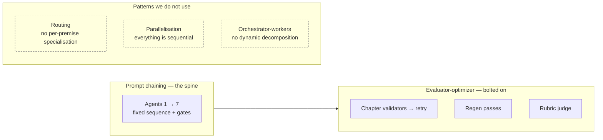
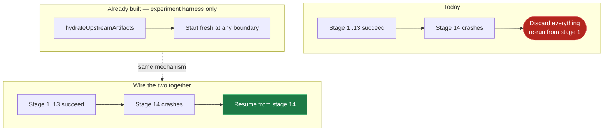
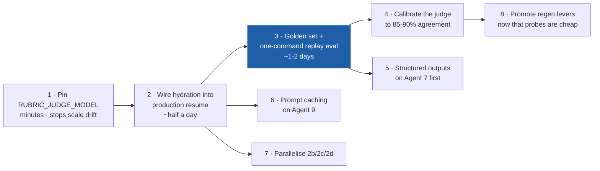

# Architecture Review — where we stand against the field

**Companion to:** [README.md](README.md) — that document describes the system as built; this one judges it.

**Written:** 2026-08-01 · **Method:** the current pipeline read from source, compared against published guidance on agent workflow patterns, durable execution, LLM-as-judge evaluation, eval-driven development, and constrained decoding. Sources at the end.

**Bias to declare:** written by the same author as the README, immediately after a board that found three measurement bugs. That biases this review toward measurement problems. Weight §4 — what *not* to change — accordingly.

---

## 0. Task tracker

**Progress: 13 / 17 complete** · Last updated 2026-08-01

Consolidated view of every task in this document. **R**-series = remediation ([§7](#7-remediation-backlog)), **S**-series = simplification ([§5.7](#57-simplification-tasks)). The detail sections are authoritative on *how*; this table is authoritative on *state*.

`todo` · `wip` · `done` · `dropped` — update the Status cell and the progress count above when a task moves. A task is **ready** when its `Blocked by` cell is `—` or every ID listed there is `done`.

**What "done" means here, and what it does not.** Every completed task is built, unit-tested in both
directions, type-checked, and verified through `npm run build:all` + `preflight-dist-check`. **None of
the new behaviour levers has been through a live pipeline run** — every one ships flag-gated and
default-OFF, so the shipped behaviour is unchanged, and each flag's settling probe is recorded in
[FLAG-AUDIT.md](FLAG-AUDIT.md). Read the Probe column as the outstanding work.

| ID | Status | Task | Blocked by | Probe still owed |
|---|---|---|---|---|
| **R1** | `done` | Pin the rubric judge model | — | — (config; verify `judge_model_source` on next run) |
| **R2** | `done` | Fix Agent 2c's undefined-narrative read | — | — (sweep found no other violation) |
| **R3** | `done` | `json_schema` structured outputs in the Azure client | — | — (capability only, zero call sites changed) |
| **R4** | `done` | Apply structured outputs to Agent 7 | R3 | One run per arm; compare `[R4]` coercion counters |
| **R5** | `done` | Wire hydration into production resume | — | Kill a live run at Agent 9, resume, confirm 0 LLM calls for stages 1–13. **Known limitation:** the CLI does not write regenerated stages back to `data/store.json` (the API owns that writer), so a resumed run is not itself resumable |
| **R6** | `done` | Golden-set eval harness, one command | R5 | `npm run eval:baseline` — costs LLM spend; dry run verified across 4 bundles |
| **R7** | `todo` | Calibrate the rubric judge | R6 | 👤 **Needs a human.** An agent cannot supply the ground truth |
| **R8** | `done` | Prefix-order Agent 9 prompts for automatic caching | — | Cached-token counts rising from ch2; prose unchanged |
| **R9** | `done` | Parallelise Agents 2b / 2c / 2d | R2 | Byte-identical artifacts vs the sequential path |
| **R10** | `done` | Write the ADRs | — | 👤 Owner to ratify — 11 drafted in [decisions/](decisions/) |
| **S1** | `done` | Flag audit — all 33 `AGENT9_*` classified | — | — (2 deleted; 8 PROMOTEs await R6) |
| **S2** | `done` | Delete the dead `@cml/utils` package | — | — |
| **S3** | `done` | Regen pass registry + shared tail | — | — (see note below on scope) |
| **S4** | `todo` | Split `agent9-run.ts` on the generate / ship / report seam | S3 | 6,512 lines today (was 7,078) |
| **S5** | `done` | Merge the two `enforceMonthSeasonLock*` variants | — | — |
| **S6** | `todo` | Extract `agent9-prose/` into its own package | S4 | **Unblocked** — the package cycle that made it impossible is now broken |
| **S7** | `todo` | Retire coercion sites proven dead by R4's counters | R4 | Counters exist; needs live runs to read them |

### Does any of this move the score toward 80?

**No. Not one point, and that is by construction — but it means this work must not be mistaken for
progress on the target.**

Measured against [TARGET_80_LEDGER](../documentation/plan/target_80/TARGET_80_LEDGER.md):

| | |
|---|---|
| External (ChatGPT) mean | **73.25** (75 / 69 / 73 / 76) — **6.75 short of 80** |
| Internal rubric | median 61–64 across the last three batches |
| Internal − external gap | **−9.5**, per-run −16 / −3 / −13 / −6 |
| Category floor | clues 5.31 · prose 5.44 · plot_structure 5.56 · pacing/ending 6.00 (target 8) |
| Ledger's own verdict | *"the gap is now RAW CRAFT"* · *"P5 (craft levers) is the critical path; do not spend more on reliability"* |

Every completed R- and S-task above is reliability, cost, measurement, or maintainability. R5 saves a
crashed run; R9 saves minutes; R8 saves tokens; R3/R4 remove a class of shape bug; S1–S6 remove mass.
**None of them changes a category mark**, and everything that touches prose ships default-OFF, so a
run today is byte-identical to a run before this work. The ledger explicitly says not to spend more
here. That instruction was already true when this review was written; §1's grading of *failure
recovery* as **D** is what pulled attention back to it.

**The one item on the critical path is R6**, because P5's craft levers are blocked on measurement
cost — and R6 has two limits that decide whether it actually unblocks them:

1. **It scores with the internal judge, and the target is the external read.** The internal judge
   under-scores by 9.5 with a per-run spread of 13 points — wider than the entire 6.75-point gap to
   80. An internal delta is a hypothesis about the external score. `npm run eval:external` now emits
   the package that makes the real number collectable; **R7 remains the task that closes this**, and
   it is the only one that needs a human.
2. **It cannot measure upstream craft.** A bundle freezes `cml`, `clues` and `outline`, so replay
   measures how well prose renders a *fixed* structure. `plot_structure` and much of `clues` — two of
   the four worst categories — cannot move here whatever changes. The ledger already recorded this
   shape: the dual-value A/B needed fresh runs because *"replay was structurally unable to measure
   it."* Fresh-run batches stay the instrument for upstream work; the harness covers prose,
   opening_hook, dialogue, pacing, atmosphere, ending, character_clarity.

Both limits are now printed by the harness on every scored run, and upstream-pinned categories are
shown but never allowed to gate.

**Self-audit, 2026-08-01.** A review pass over the completed work found two real defects in R5's
stage guard, both now fixed and both covered by tests that fail without the fix:

- **Crash.** Skipping was decided per-stage independently, so a store holding `hard_logic_devices`
  but no `cml` would skip Agent 3b and then run Agent 3 — which reads `ctx.hardLogicDirectives`,
  state only Agent 3b writes, and calls `.hardLogicModes.join()` on it. TypeError, on the most likely
  resume case of all (a run that died inside Agent 3). Fixed by resuming only a **contiguous prefix**:
  once any stage runs, every later stage runs.
- **Silent gate bypass.** Restoring a stage's artifact restores only its *primary* output. Agents 3,
  5, 6 and 7 also write derived state no artifact captures (`noveltyAudit`, `coverageResult`,
  `outlineCoverageIssues`). The gates reading them use optional chaining, so missing data read as
  "nothing wrong" and a resumed run passed binding gates that never evaluated. Fixed by declaring
  each stage's unpersisted outputs, warning loudly per lost signal, and recording
  `signals_unavailable` / `gates_fully_evaluated` on the report so a resumed run cannot be mistaken
  for equivalent evidence.

The second is the more instructive: it is the same silent-failure shape §2.4 describes, introduced by
the remediation work itself, and it would not have been visible in any test that only asked "did the
run finish?"

**Two scope notes, stated rather than buried.**

- **S3** delivered the registry, the family classification, and the shared result tail — the twelve
  near-identical wrappers are gone. The twelve *detectors* remain as separate functions: they are
  genuinely different logic (regex, ledger lookup, cross-chapter scan), not duplication, so collapsing
  them would trade a real reduction for an artificial one. The stated goal — "the set of defects the
  system can repair, enumerable in one place" — is met by
  [`regen-registry.ts`](../packages/prompts-llm/src/agent9-prose/regen-registry.ts), and a test fails
  if a thirteenth pass is added without registering it.
- **S6 could not be done as written.** §5.5 asserts "the engine consumes prompts; it is not one" —
  that was true in one direction only. `world-state.ts` and `story-bible.ts` imported *into*
  `agent9-prose/`, while fourteen modules inside it import from the package root. Extracting the
  directory would have produced a package **cycle**, not a layer. The two back-edges have now been
  removed (`shared/locked-fact-atoms.ts`, `types/macro-arc.ts`), so the extraction is now a mechanical
  move. It was not attempted because §5.7 sequences it after S4.

**Applies to every task:** flag-gated + runtime-read + default-OFF for behaviour changes · `npm run build:all` then `node scripts/preflight-dist-check.mjs` before believing any result · both-directions tests · stop and report rather than widening scope. Full conventions in [§7](#7-remediation-backlog).

---

## 1. Verdict up front

The core decomposition is right, and it matches what the field independently recommends. The weaknesses are not in the pipeline shape — they are in the **loop around it**: failure recovery, evaluation, and the interface between the LLM and our code.

| Dimension | Grade | One-line reason |
|---|---|---|
| Pipeline decomposition | **A** | Textbook prompt chaining with gates; the task really is cleanly decomposable |
| Determinism & repeatability | **A−** | Frozen bible, hydration, matched-pair A/Bs, flag discipline |
| Failure recovery | **D** | A run that dies at stage 14 discards 13 stages of work — **and the fix is already written** |
| LLM ↔ code interface | **C−** | Parse-and-repair where constrained generation is now available |
| Evaluation | **C** | Rich telemetry, no golden set, uncalibrated judge, manual £4–8 experiments |
| Repair strategy | **B−** | Correct ladder, but weight sits on the bottom rung, which is the prose problem |
| Observability | **B+** | Excellent *within* a run; weak *across* runs |

**The through-line.** Every high-cost defect this project has chased in the last ten boards falls into one of two buckets: *a repair that shipped machine prose*, or *a measurement that was silently wrong*. Neither is a decomposition problem. Both are loop problems.

---

## 2. What the field says, and where we sit

### 2.1 We are already using the recommended pattern

Anthropic's [Building Effective Agents](https://www.anthropic.com/research/building-effective-agents) names five workflow patterns and is explicit that **prompt chaining** — sequential LLM calls with programmatic gates between them — is the right choice "where the task can be easily and cleanly decomposed into fixed subtasks."

That is exactly our pipeline, and our three binding gates are exactly the recommended gates. The guidance also warns against reaching for autonomous agents, which carry "higher costs and compounding error risks." **Our sequential-orchestrator design is not a legacy compromise to be modernised away — it is the recommended architecture for this problem.** Worth saying plainly, because "13 hardcoded stages" reads like technical debt and isn't.

Mapping our stages onto the five patterns:



Two of the three absences are correct. **Orchestrator-workers** is for problems where you can't predict the subtasks; ours are fixed by the genre. **Routing** would mean specialising by premise — plausible one day, not a gap now.

**Parallelisation is a genuine miss.** Agents 2b, 2c, and 2d — character profiles, location profiles, temporal context — are independent reads off the same frozen CML. They run sequentially for no structural reason. The pattern's stated purpose is exactly this: independent subtasks, "sectioning," run simultaneously. That is minutes of wall-clock per run, and it lowers the cost of the N≥4 batches that gate every decision.

### 2.2 Evaluator-optimizer, without its precondition

Our regen passes are an evaluator-optimizer loop: a detector evaluates, a targeted rewrite optimises. The guidance attaches a precondition — the pattern works "when we have clear evaluation criteria and when iterative refinement provides measurable value."

We satisfy the first half well. **We have never established the second half.** No regen pass has a published before/after quality delta; the one A/B that ran to completion discovered the lever had never executed at all. We are running an optimiser loop on faith that optimising helps.

### 2.3 Where we diverge most sharply: evaluation

Published 2026 practice for LLM pipelines has converged on something we do not have:

- **A golden dataset with human-annotated references**, with the judge calibrated to **85–90% agreement** against it before it is trusted.
- **Regression gates in CI** — every prompt change runs evals pre-merge; a drop below baseline blocks the merge.
- **Known judge failure modes** — position bias, self-preference, and the meta-evaluation problem ("who evaluates the evaluator"). A 100% pass rate is read as *the eval is too easy*, not as success.

Against that:

| Practice | Us |
|---|---|
| Golden dataset | None. 14 shipped stories, unlabelled |
| Judge calibration | **Never done.** A_67 §3.2 has "judge sensitivity unproven" open |
| Judge model | Inherits `AZURE_OPENAI_DEPLOYMENT_NAME` — the *cheapest* deployment, and it silently changes when the base model changes |
| Pre-merge quality gate | None. 1,387 unit tests cover **code**; nothing covers **prose** |
| Cost per quality signal | £4–8 and ~2h per A/B, run by hand, N=4 |

That last row is the compounding one. When measuring costs hours and pounds, you measure rarely; when you measure rarely, you ship on intuition; and the boards are a record of intuitions that turned out to be wrong — "(common)" on a lever that fired 0/18, a cap panel hand-tallied wrong, a "weakest phase" that was a scorer bug.

### 2.4 Parse-and-repair is now the expensive option

Reported reliability for schema-shaped output: **80–95% with prompt engineering** — failing *silently on edge cases* — versus **schema-valid by construction** with native structured outputs and constrained decoding, which shape the token distribution at generation time rather than fixing things afterward.

We are firmly in the first regime and paying its full tax: `jsonrepair` in five agents, ~55 coercion/normalisation sites, and a recurring class of shape bugs that **fail silently in exactly the way the literature predicts** — `relationships` as a bare array vs `{pairs}`, scene fields nested under `setting`, `role_archetype` vs `roleArchetype`.

---

## 3. The five gaps that matter

Ranked by (leverage ÷ cost). The first is close to free.

### Gap 1 — Durable execution: the fix is already written, in the wrong place

**The problem.** A run is a single in-process async call. Any failure after stage 1 discards everything before it. A crash at Agent 9 throws away thirteen stages and ~£1.40 of the ~£1.50 run cost. The corpus contains runs lost to a hung socket, a Windows process abort, and a laptop entering standby.

**The finding.** [`scripts/canary-agent-boundary.mjs`](../scripts/canary-agent-boundary.mjs) already implements `hydrateUpstreamArtifacts` — it rehydrates a prior run's upstream artifacts and starts fresh from any agent boundary. **That is durable-execution resume.** It exists, it works, it is used on every A/B. It is simply not wired to production failure recovery.



**Why it is cheap.** Artifacts are already persisted per stage (`onArtifact`, `documentation/prompts/actual/run_*/`). Stage boundaries are already the checkpoint granularity the field recommends. This is plumbing between two things we own, not new infrastructure.

**Why it compounds.** Every batch gate is "N consecutive runs, zero aborts." An infrastructure death today burns a slot and restarts the count. With resume, it costs one stage.

**Do not** adopt Temporal or a workflow engine for this. The literature's value proposition — automatic checkpointing, replay, idempotency — we already have most of, at our scale, in our own code. Buying a distributed workflow engine for a single-process single-user pipeline is the complexity the same guidance warns against.

### Gap 2 — The judge that gates everything is uncalibrated

The rubric judge caps categories, gates the release, and is the number every board argues over. It has never been checked against a human label, and it runs on whatever `AZURE_OPENAI_DEPLOYMENT_NAME` happens to be — so **changing the base model silently retunes the scale that grades every run.** A_71 added `judge_model` to the artifact so at least the drift is now visible; visibility is not calibration.

The standard is concrete and achievable: hand-label a set of chapters against the rubric, measure agreement, and iterate the judge prompt until it lands at 85–90%. Until then, every rubric delta in the ledger has an unknown error bar — which matters most precisely when a delta is small, and small deltas are what the A/Bs produce.

Cheap first move: **pin `RUBRIC_JUDGE_MODEL` explicitly.** It costs nothing and stops the scale moving underneath the ledger.

### Gap 3 — No prose-quality regression suite

We have excellent code tests and no quality tests. Every prose regression has been caught by an *external human read*, after shipping, sometimes boards later.

The asymmetry is stark: a code change that breaks a validator fails in seconds in CI; a prompt change that makes prose worse is invisible until someone reads a story. Given that prompts are edited more often than validators, the testing is inverted relative to the risk.

What is missing is a **golden set**: a handful of frozen upstream artifact bundles, replayed through Agent 9 on demand, scored by the calibrated judge, diffed against a stored baseline. The pieces exist — hydration (Gap 1), the rubric scorer, the A/B analyzer. What is missing is a cheap **one-command** path from "I changed a prompt" to "here is the delta."

### Gap 4 — The repair ladder is bottom-heavy

Architecturally the ladder is right. In practice most obligations still land on rung 3, the deterministic injector, because the LLM rungs are flag-gated OFF pending probes that cost £4–8 each.

That is a **direct consequence of Gap 3**: expensive measurement means levers stay off; levers staying off means the deterministic floor ships; the deterministic floor is what external reviewers call "generated validation prose." The prose ceiling is not primarily a craft problem — it is a *measurement-cost* problem wearing a craft costume.

Fix Gap 3 and this one substantially unblocks itself.

### Gap 5 — Context engineering in Agent 9

Current published criteria for agent context are **relevance, sufficiency, isolation, economy, provenance**, with a move toward just-in-time loading over stuffing everything upfront.

Agent 9 scores well on sufficiency and provenance — the frozen bible is a genuinely good provenance mechanism, and worth keeping. It scores poorly on **economy**: every chapter prompt carries the full bible, cast, locations, and temporal context whether that chapter needs them or not. That is why prompt caching (no `cache_control` anywhere in our codebase today) is the highest-value cheap win here, and why per-chapter context slimming is the follow-up.

---

## 4. What NOT to change

Things that look like debt and are load-bearing. This section exists because the largest risk in acting on a review is "modernising" something that was a considered decision.

| Looks wrong | Actually | Leave it |
|---|---|---|
| 13 hardcoded sequential stages | The recommended pattern for cleanly decomposable tasks | ✅ |
| Big orchestrator file | Reads top-to-bottom in pipeline order; a reader can follow one path | ✅ |
| Deterministic injectors producing flat prose | The never-abort floor. Removing them trades quality for shipped-story rate | ✅ keep as floor |
| Duplicated validation (chapter + whole-story) | Different scopes; cross-chapter defects are invisible per chapter | ✅ |
| Flag-gated default-OFF everywhere | Corpus-era regime. Slow, and it is what stopped the pipeline regressing under 70 boards of change | ✅ |
| No queue / no microservices | Single-user, single-run-at-a-time. A queue would add failure modes and buy nothing | ✅ |

---

## 5. Simplification

**The framing that matters:** simplification here is not tidiness. This codebase's expensive defects have a consistent shape — *one defect with several bodies*, and *code paths that ship but are never exercised*. Both are direct products of duplication and configuration sprawl. Cutting mass is defect-class removal, which puts it on the same footing as the remediation work rather than below it.

Measured, 2026-08-01: **108,286 lines** of source across 14 packages and 3 apps.

### 5.1 Feature-flag sprawl — the biggest single source of untested surface

**148 distinct environment flags** are referenced in source. Agent 9 alone owns **33**, of which **19 are unset**:

```
SET (14)    BIBLE_AUTHORITATIVE · CRITIQUE_REWRITE · MODEL_CRITIQUE · MODEL_REGEN
            MODEL_REWRITE · POLISH_PROVIDER · REGEN_CLUE · REGEN_CULPRIT_EVIDENCE
            REGEN_LOCKED_FACT · REGEN_MECHANISM · REGEN_RESOLUTION · REGEN_SCAFFOLD
            REGEN_SUSPECT_ELIM · REGEN_TRANSITION · WALKON_REPAIR

UNSET (19)  AFTERMATH_FINAL_SIGNAL_FALLBACK · BIBLE_GATES_BLOCKING · FOLD_SUSPECT_CLEARANCES
            FULLSTORY_DIAGNOSTIC · FULLSTORY_POLISH · GROUNDING_LEAD · MODEL_POLISH
            MUTATION_REVALIDATION · POLISH_ANTHROPIC_MODEL · POLISH_HIGH_LEAKAGE_CHAPTERS
            POLISH_RETRIED_CHAPTERS · PROMPT_TOKEN_CEILING · REDESIGN_V1 · REGEN_DUAL_VALUE
            REGEN_LEAKAGE · REGEN_PRONOUN · REVEAL_CITES_PLANTS · VOICE_ENFORCE
```

Nominally that is 2³³ configurations for Agent 9. **Exactly one is ever executed** — whatever `.env.local` currently holds. Every unset flag guards a branch that ships in the dist, is covered by unit tests in isolation, and has never run inside a real pipeline. When one is eventually switched on, it interacts with thirteen other flags for the first time.

The flag regime itself is correct and earned — §4 defends it. What is missing is the **other half of the lifecycle: flags must exit.** Right now they only accumulate. A flag has three legitimate end states and none of them is "stay unset indefinitely":

| End state | Trigger |
|---|---|
| **Promoted** — default-ON, flag deleted | Probe showed a win |
| **Deleted** — code removed | Probe showed no effect, or the premise was invalidated |
| **Documented deferral** — flag kept, with a named blocker and a date | Probe not yet affordable |

At least three flags already have a determined fate and are still sitting there. `AGENT9_MODEL_POLISH` is superseded — `AGENT9_POLISH_PROVIDER=anthropic` solved the frontier-deployment blocker it was waiting on. `AGENT9_REDESIGN_V1` reads like a migration switch that has outlived its migration. And the A_70 board proved `AGENT9_FULLSTORY_POLISH`'s phrase path had never functioned at all.

**This is the cheapest large win in the document.** Deleting a flag deletes a branch, its tests, its documentation, and one dimension of the interaction space.

### 5.2 `agent9-run.ts` — 7,078 lines in one file

The largest source file, by 53% over the next. For comparison, the entire `llm-client` package is 2,008 lines.

The argument for splitting is *not* that big files are bad. It is that **the file has a real seam it does not express.** [README §4](README.md) documents the load-bearing boundary — generation versus ship-layer post-processing — and notes that misplacing work across it has caused the same bug class at least three times. That boundary is architecture. In the file it is implicit, marked only by comments.

Splitting along it (`agent9-generate.ts` / `agent9-ship.ts` / `agent9-report.ts`) turns a convention into a structure the compiler can enforce, and makes "does this run before or after prose stops changing?" answerable from the import graph rather than from line numbers.

### 5.3 Twelve regen passes with one shape

```
runCaseTransitionRegenPass    runClearanceRegenPass       runClueRegenPass
runCulpritEvidenceRegenPass   runDualValueContrastRegenPass  runInsertionRegenPass
runMechanismRevealRegenPass   runResolutionRegenPass      runScaffoldRegenPass
runSuspectEliminationRegenPass runTemplateLeakageRegenPass runVoiceLeakagePass
```

All twelve live in one 1,337-line `regen-integration.ts`, take a similar args object, and return the same `InsertionRegenPassResult`. They differ in three things: which detector fires, which defect kind is reported, and which instruction the regen prompt carries.

That is a **registry, not twelve functions**. One parameterised `runRegenPass(spec)` plus a table of `{ detect, defectKind, instruction, flag }` would collapse ~1,300 lines to a few hundred and — more valuably — make the set of defects the system can repair *enumerable in one place*. Today, answering "which obligations have an LLM repair path?" means reading a 1,337-line file.

This is also the structural fix for the trap that keeps recurring: when repair logic is one table, a defect cannot quietly acquire a second body.

### 5.4 Dead and near-dead code

| Item | Evidence | Action |
|---|---|---|
| `@cml/utils` | **1 line** (`export const packageName`), **zero importers** outside itself. Carries a package.json, tsconfig, build step, and dist output | Delete the package |
| `enforceMonthSeasonLockOnChapter` + `…WithTelemetry` | Textbook duplicate-with-variant | Collapse to one with optional telemetry |
| Coercion layer (~55 sites) | Partially obsoleted once R3/R4 land | Delete **per agent**, only where counters prove it stopped firing |

`@cml/utils` is trivial in isolation and worth naming anyway: it is a whole build target producing nothing, and it dilutes the "14 packages" figure that shapes how people reason about the layout.

### 5.5 Package boundaries that no longer describe the code

**`prompts-llm` is 35,873 lines — 33% of the entire codebase**, three times the next largest package. Its name says "prompts", but `agent9-prose/` inside it is a full generation engine: batching, retry strategy, validators, repair, polish, telemetry. Prompt *authoring* and prose *engineering* are different concerns with different change rates, and the package boundary hides that.

Extracting `agent9-prose/` into its own package would make the dependency real — the engine consumes prompts; it is not one.

**`cml` (1,165) and `cml-core` (1,406)** are two packages for one domain. The split may be load-bearing — a core with no dependencies, plus a layer with them is a legitimate pattern — but it is worth confirming the boundary still matches reality rather than inheriting it.

### 5.6 What NOT to simplify

Same discipline as §4. These look like duplication and are not:

| Looks redundant | Actually | Verdict |
|---|---|---|
| Chapter validators *and* whole-story validators | Different scopes — cross-chapter defects are invisible per chapter | Keep both |
| Deterministic injectors alongside regen passes | The injector is the never-abort *floor* under the regen. Removing it trades shipped-story rate for prose quality | Keep the ladder |
| Rubric judge *and* structural verifiers | The verifiers exist to veto the judge on checkable claims — that is the check on an uncalibrated judge | Keep both |
| `story-validation` at 16,726 lines | Genuinely many independent validators, each small | Leave it |
| The flag *mechanism* | Corpus-era regime; it is what stopped 70 boards of change from regressing the pipeline | Keep — add the exit path (§5.1) |

### 5.7 Simplification tasks

Same conventions as §7. These are deliberately independent of the R-series except where noted.

| ID | Task | Blocked by | Effort | Net |
|---|---|---|---|---|
| S1 | Flag audit: classify all 33 `AGENT9_*` as promote / delete / defer-with-blocker; delete the settled ones | — | 3–4 h | −branches |
| S2 | Delete `@cml/utils`; remove from `build:all` and any workspace refs | — | 20 min | −1 package |
| S3 | Collapse the 12 regen passes to one parameterised pass + defect registry | — | 1 day | ~−900 lines |
| S4 | Split `agent9-run.ts` along the generate / ship / report seam | S3 | 1 day | structure, not size |
| S5 | Merge the two `enforceMonthSeasonLock*` variants | — | 30 min | −1 duplicate |
| S6 | Extract `agent9-prose/` from `prompts-llm` into its own package | S4 | 1 day | boundary honesty |
| S7 | Retire coercion sites where R4's counters prove they no longer fire | R4 | ongoing | −55 sites eventually |

**Sequencing note.** S1, S2 and S5 are safe now and independent of everything else. **S3 before S4** — collapsing the regen passes first means the file split moves a much smaller body of code. S6 last: it is the largest blast radius and the least urgent.

**Do all of these behind the same discipline as any other change.** A pure refactor is exactly where "green tests, stale dist" bites hardest, because there is no behaviour change to notice if the worker is running yesterday's code.

---

## 6. Sequenced plan

Ordered so each step lowers the cost of the next.



**Step 3 is the keystone.** Nearly every open item on the board is gated on "we would need to run an A/B, and that costs £4–8 and two hours." Make the answer cost minutes and the backlog stops being budget-bound.

---

## 7. Remediation backlog

Tasks are written to be picked up and executed without further clarification. Each states its dependency, the files it touches, what "done" means, and how to verify. **Order is by dependency, not priority** — the `Blocked by` field is authoritative.

Conventions that apply to every task below:

- **Corpus-era regime.** Any behaviour change ships flag-gated, runtime-read (`process.env.X` *inside* the function, never a module const), and default-OFF unless the task says otherwise.
- **Build before believing.** `npm run build:all` then `node scripts/preflight-dist-check.mjs` — the worker consumes `@cml/*` via dist, so green vitest does not mean the worker sees your change.
- **Both-directions tests.** Every fix ships with a test that fails before and passes after, *and* a test proving it does not fire on the negative case.
- **No silent scope growth.** If a task turns out to need a second change, stop and report rather than widening.

| ID | Task | Blocked by | Effort | Needs |
|---|---|---|---|---|
| R1 | Pin the rubric judge model | — | 5 min | — |
| R2 | Fix Agent 2c's undefined-narrative read | — | 1 h | — |
| R3 | Add `json_schema` structured outputs to the Azure client | — | 3–4 h | — |
| R4 | Apply structured outputs to Agent 7 | R3 | 3–4 h | — |
| R5 | Wire hydration into production resume | — | ~1 day | — |
| R6 | Golden-set eval harness, one command | R5 | 1–2 days | LLM spend |
| R7 | Calibrate the rubric judge | R6 | 1–2 days | **human labelling** |
| R8 | Prefix-order Agent 9 prompts for automatic caching | — | 3–4 h | — |
| R9 | Parallelise Agents 2b / 2c / 2d | R2 | 3–4 h | — |
| R10 | Write the ADRs | — | 2–3 h | **human decisions** |

---

### R1 — Pin the rubric judge model

**Why.** `runRubricScoring` resolves `process.env.RUBRIC_JUDGE_MODEL || process.env.AZURE_OPENAI_DEPLOYMENT_NAME`. The flag is unset, so the judge that gates and caps every run silently follows the base deployment. Changing the base model retunes the scale grading the whole ledger.

**Files.** `.env.local`

**Steps.**
1. Add `RUBRIC_JUDGE_MODEL=gpt-4.1-mini` next to the other model settings, with a comment naming why it is pinned.
2. Do not change the resolution logic — the fallback is correct for anyone without the var set.

**Acceptance.** Next run's `rubric_score` diagnostic shows `judge_model_explicit: true` and `judge_model_source: "RUBRIC_JUDGE_MODEL"`, and the A_71 info-band warning about an inherited judge no longer fires.

**Risk.** None. Pure config; reversible by deleting the line.

---

### R2 — Fix Agent 2c's undefined-narrative read

**Why.** [`agent2c-run.ts:169`](../apps/worker/src/jobs/agents/agent2c-run.ts#L169) passes `narrative: ctx.narrative!` to `generateLocationProfiles`. `ctx.narrative` is assigned **only** at [`agent7-run.ts:2258`](../apps/worker/src/jobs/agents/agent7-run.ts#L2258), and Agent 7 runs at orchestrator line ~1210 while Agent 2c runs at ~986. **The value is `undefined` on every run**; the non-null assertion silences the compiler. Location profiles have never received narrative context. Found during this review — exactly the silent-failure class §2.4 describes.

**Files.** `apps/worker/src/jobs/agents/agent2c-run.ts`, `packages/prompts-llm/src/agent2c-location-profiles.ts`

**Steps.**
1. Confirm the finding first — do not assume this document is right. Log or assert `ctx.narrative` at the 2c call site on one run.
2. Read `generateLocationProfiles` and establish what `narrative` is *used for*. Two outcomes, and the fix differs:
   - **Used meaningfully** → this is an ordering bug. Do **not** reorder the pipeline (Agent 7 needs location profiles; reordering creates a cycle). Instead make the parameter genuinely optional and have the prompt degrade cleanly without it.
   - **Unused / vestigial** → delete the parameter and the three `ctx.narrative` references at lines 132, 169, 284.
3. Remove the `!` assertion either way. It is the mechanism that hid this.
4. Sweep for the same pattern: `grep -rn "ctx\.[a-zA-Z]*!" apps/worker/src/jobs/agents/` and check each assertion against the orchestrator's call order. Report any others found — **do not fix them in this task.**

**Acceptance.** No non-null assertion on `ctx.narrative` in 2c; a test pins the chosen behaviour; the sweep result is reported.

**Risk.** Low. If `narrative` was genuinely unused, output is unchanged. If it was used, location profiles change — flag that in the report, as it shifts prose inputs.

---

### R3 — Add `json_schema` structured outputs to the Azure client

**Why.** `ChatOptions` supports only `jsonMode` → `response_format: {type: "json_object"}`, which guarantees *valid JSON* but not *your schema*. Azure OpenAI supports `json_schema` with `strict: true` on gpt-4.1, which is schema-valid by construction. This is the enabler for retiring the ~55-site coercion layer. **No provider switch is required** — an earlier suggestion of mine implied otherwise; Azure has this natively.

**Files.** `packages/llm-client/src/types.ts`, `packages/llm-client/src/client.ts`, plus tests

**Steps.**
1. Add an optional `jsonSchema?: { name: string; schema: object; strict?: boolean }` to `ChatOptions`.
2. In `client.ts`, when present, send `responseFormat: { type: "json_schema", json_schema: {...} }`. `jsonSchema` and `jsonMode` are mutually exclusive — throw on both.
3. Handle the refusal/incomplete paths: a `strict` call can return `finish_reason: "content_filter"` or a truncated response. Surface these as distinct, typed errors, not as parse failures.
4. Document the Azure schema subset in a comment: `additionalProperties: false` required on every object, every property in `required`, no recursion, limited string/number constraints.
5. Do **not** change any agent yet. This task ships the capability only.

**Acceptance.** Unit tests cover: schema forwarded correctly; mutual exclusion throws; refusal and truncation produce distinct errors. `packages/llm-client` suite green. Zero behaviour change on every existing call site.

**Risk.** Low — purely additive.

---

### R4 — Apply structured outputs to Agent 7

**Why.** Agent 7 has the worst shape-drift history in the pipeline: `coerceNarrativeSceneBeats`, `hoistMisplacedSceneFields`, the retry-path coercion gap. It is upstream of Agent 9, so a fix propagates. And unlike a prose stage it can be verified deterministically — no external read needed.

**Blocked by:** R3.

**Files.** `packages/prompts-llm/src/agent7-narrative.ts`, `apps/worker/src/jobs/agents/agent7-run.ts`

**Steps.**
1. Derive a JSON Schema from the existing narrative-outline TypeScript types. If any part is recursive, flatten it — note what you flattened.
2. Gate on `AGENT7_STRUCTURED_OUTPUT` (runtime getter, default OFF).
3. **Keep the coercion layer in place.** It becomes the fallback for the flag-off path and the safety net for the flag-on path.
4. Add telemetry counting how often each coercion helper actually fires under each arm — that count *is* the evidence for whether the layer can eventually be deleted.
5. Run the pipeline once per arm on the same premise. Compare outline structure and the coercion counters.

**Acceptance.** Flag OFF is byte-identical to today. Flag ON produces a schema-valid outline with coercion counters at or near zero. Both arms' outlines pass the existing Agent 7 validators.

**Risk.** Medium — a wrong schema fails the call rather than degrading. That is why it is flagged, and why coercion stays.

---

### R5 — Wire hydration into production resume

**Why.** The single highest-leverage item in this review. A failure after stage 1 discards everything before it. `hydrateUpstreamArtifacts` in [`scripts/canary-agent-boundary.mjs`](../scripts/canary-agent-boundary.mjs) already does exactly the required job for the A/B harness.

**Files.** new module under `apps/worker/src/jobs/` (e.g. `run-hydration.ts`), `scripts/canary-agent-boundary.mjs`, `apps/worker/src/jobs/mystery-orchestrator.ts`

**Steps.**
1. Extract the hydration logic out of the `.mjs` script into a typed worker module. **The A/B harness must then import it** — two copies would reproduce the one-defect-several-bodies trap this codebase keeps hitting.
2. Verify the extraction changed nothing: run one A/B arm before and after and confirm identical hydrated artifacts.
3. Add `resumeFromRunId?: string` to the orchestrator inputs. When set: hydrate all artifacts persisted for that run, skip any stage whose artifact is present, and start at the first missing one.
4. Skipped stages must still register their phase score in the report — from the persisted artifact — so a resumed run produces a complete report. Mark the report `resumed_from: <runId>` so the ledger can tell resumed runs from fresh ones.
5. Refuse to resume across a dist rebuild: if the persisted run's code fingerprint differs from the current build, fail loudly rather than mixing generations of code.

**Acceptance.** Kill a run during Agent 9. Resume it. Verify from `llm-prompts-full.jsonl` that **zero** LLM calls are made for stages 1–13, the story completes, and the report contains all 14 phases.

**Risk.** Medium. The hazard is hydration fidelity — a hydrated artifact that differs subtly from its in-memory original produces a run that is neither fresh nor faithful. Step 2 is the guard; do not skip it.

---

### R6 — Golden-set eval harness, one command

**Why.** The keystone. Prose quality is currently only measurable by a £4–8, two-hour, hand-run A/B, which is why levers stay OFF and the deterministic floor ships. Make measurement cheap and the backlog stops being budget-bound.

**Blocked by:** R5 (shares the hydration path).

**Files.** new `scripts/eval-golden.mjs`, new `eval/golden/` fixture directory, `package.json`

**Steps.**
1. Freeze 4–6 upstream artifact bundles from existing runs, chosen for premise diversity. Commit the *bundles*, not whole run directories.
2. Script: for each bundle, replay Agent 9 → score with the rubric → collect caps, category marks, and the release gate.
3. Store a baseline JSON. Print a per-bundle and aggregate delta table against it.
4. Add `npm run eval` and `npm run eval:baseline` (the latter re-baselines deliberately).
5. Non-zero exit if any category regresses beyond a threshold, so it can gate a merge later.
6. Print the total cost of the run from `llm-prompts-full.jsonl`, never from `report.total_cost`.

**Acceptance.** `npm run eval` completes unattended and prints a delta table. Two consecutive no-change runs show variance small enough to distinguish signal — **if it does not, report that**; it means the harness needs more bundles or averaged repeats before it can gate anything.

**Risk.** Medium. The real risk is a harness too noisy to be trusted, which is worse than none because it manufactures confidence. Acceptance explicitly tests for it.

---

### R7 — Calibrate the rubric judge

**Why.** The judge caps categories and gates releases and has never been checked against a human label. Published practice is 85–90% agreement with a human-annotated reference before a judge is trusted. Until then every rubric delta carries an unknown error bar — worst exactly when deltas are small, which is what A/Bs produce.

**Blocked by:** R6. **Requires a human** — an AI agent cannot supply the ground truth this task calibrates against.

**Steps.**
1. *(agent)* Extract 20–30 chapters from shipped stories spanning the observed quality range. Present each with the rubric categories and blank scores.
2. *(human)* Score them independently, without seeing the judge's output.
3. *(agent)* Run the judge over the same chapters. Compute per-category agreement and identify systematic bias — is it lenient, harsh, or inconsistent on specific categories?
4. *(agent)* Iterate the judge prompt against the human set until agreement reaches 85–90%. Hold out ~20% to check you have not overfitted the prompt to the labels.
5. *(agent)* Record the final agreement figure in the rubric diagnostic so every future run carries its judge's known accuracy.

**Acceptance.** A documented per-category agreement figure ≥85% on held-out chapters, and the figure recorded on the artifact.

**Risk.** Low technically. The failure mode is social: an agreement number produced from labels written carelessly is worse than no number.

---

### R8 — Prefix-order Agent 9 prompts for automatic caching

**Why.** Agent 9 re-sends the bible, cast, locations, and temporal context on every chapter, retry, and regen — 30+ calls over a near-identical prefix. **Correction to my earlier advice:** on Azure OpenAI, caching is *automatic* for prompts above ~1024 tokens on exact prefix match — there is no `cache_control` to add. The lever is therefore **prompt ordering**, not a new API parameter.

**Files.** `packages/prompts-llm/src/agent9-prose/prompt-builder.ts`, `prompt-blocks.ts`

**Steps.**
1. Audit the assembled chapter prompt and classify each block: frozen for the whole run, varies per chapter, varies per attempt.
2. Reorder so all run-frozen content precedes anything variable. Move chapter number, beat list, retry directives, and prior-chapter context to the tail.
3. Hunt prefix invalidators: timestamps, per-attempt IDs, non-deterministic key order from `JSON.stringify` over an unsorted object, anything interpolating attempt count early.
4. Verify from the usage figures in `llm-prompts-full.jsonl` that cached-token counts rise across chapters within a run.

**Acceptance.** Cached prompt tokens > 0 and rising from chapter 2 onward. Chapter output unchanged — this is a reordering, not a content change, so prose should be materially unaffected.

**Risk.** Low-to-medium. Prompt order does influence model behaviour; if prose shifts noticeably, treat it as a behaviour change and put it behind a flag.

---

### R9 — Parallelise Agents 2b / 2c / 2d

**Why.** Three independent reads off the frozen CML that run sequentially. Cuts wall-clock on every run, including the N≥4 batches that gate every decision.

**Blocked by:** R2 — do not parallelise a stage with a known ordering bug.

**Files.** `apps/worker/src/jobs/mystery-orchestrator.ts`

**Steps.**
1. **Audit shared mutable state first.** Verified during this review: each agent writes a distinct artifact key (`characterProfiles`, `locationProfiles`, `temporalContext`) and reads only frozen upstream state — but all three mutate `ctx.warnings`, `ctx.agentCosts`, `ctx.agentDurations`, and call `ctx.savePartialReport()`.
2. Array and object mutation is safe under Node's event loop. **`savePartialReport` is not** — three concurrent calls race on the same file. Serialise it: skip partial saves inside the parallel block and take one snapshot after it.
3. Replace the three sequential `await`s with `Promise.all`.
4. Preserve deterministic ordering of `ctx.warnings` — sort or namespace by agent, so run-to-run diffs stay readable.
5. Confirm error handling: `Promise.all` rejects on the first failure. Each of these agents has its own retry/abort semantics — verify a failure in one still produces the same outcome it does today.

**Acceptance.** Same three artifacts, byte-identical on a fixed premise versus the sequential path. Wall-clock for the segment drops. Warnings are deterministic in order.

**Risk.** Medium — concurrency bugs are intermittent and this codebase's batch gates are sensitive to flaky aborts. If artifacts are not byte-identical, stop and report rather than accepting the difference.

---

### R10 — Write the ADRs

**Why.** §8 argues the documentation gap is *why*, not *what*. 71 boards organised by incident; no record of settled decisions, so they get re-litigated.

**Requires a human** for the actual decisions — an agent can draft the context and consequences, but not ratify the choice.

**Files.** new `architecture/decisions/NNNN-title.md`

**Candidates** (~1 page each: Context / Decision / Consequences / What would change our mind):
1. CML as single source of truth, prose as rendering
2. Sequential prompt chaining over an autonomous agent
3. Never-abort release gate with a deterministic injector floor
4. Flag-gated default-OFF with N≥4 matched-pair probes
5. Story Bible freeze — dereference, never re-derive
6. `run_outcome` derives from the release gate, not phase thresholds
7. Repair ladder ordering, and why the floor stays
8. Azure OpenAI as primary, Anthropic for polish
9. File-backed store over a database
10. Report as the durable record, chain logs as ephemeral

**Acceptance.** Each ADR names a decision that has actually been re-litigated at least once in the boards, and states what evidence would reverse it.

---

## 8. Do we need to go into more detail?

**Short answer: no — not on descriptive architecture. The gap is decisions and evals, not depth.**

The reasoning:

- **Descriptive depth is already covered and partly stale.** `documentation/03_Agents/` holds per-agent contracts; `documentation/10_prose_generation/` covers Agent 9. Adding a third layer of description means three places to keep in sync, and the README's own audit found existing docs already lagging the code. More prose about a system that is about to change is depreciating.

- **What is genuinely missing is *why*, not *what*.** We have 71 analysis boards — excellent forensics, but organised by *incident*, not by *decision*. Nowhere records "we chose a deterministic injector floor over LLM regen because X, and here is what would change our mind." That is what makes a newcomer — or us in three months — re-litigate settled questions. The high-value artifact is a small set of **ADRs** (~10 one-page decision records), not a deeper component doc.

- **The one exception worth writing:** Agent 9's ordering constraint — what runs before/after `generateProse` returns — has caused the same class of bug at least three times. That is a *sequencing contract*, and it belongs next to the code as a header comment, not in a document nobody opens while debugging.

So my recommendation for this folder:

| Doc | Verdict |
|---|---|
| `README.md` — the map | ✅ have it |
| `REVIEW.md` — this | ✅ have it |
| `DECISIONS/` — ~10 short ADRs | **worth writing** |
| Per-component deep dives | ❌ duplicates `documentation/` |
| Detailed sequence diagrams per agent | ❌ the code is the truth and changes faster |

If you want one more document, make it the ADRs. If you want one more *artifact*, make it the golden-set eval harness from step 3 — it will change more outcomes than any document.

---

## Sources

- [Building Effective AI Agents — Anthropic](https://www.anthropic.com/research/building-effective-agents) — the five workflow patterns, workflows vs agents, simplicity/transparency/ACI principles
- [Effective context engineering for AI agents — Anthropic](https://www.anthropic.com/engineering/effective-context-engineering-for-ai-agents) — just-in-time context loading
- [Context Engineering: From Prompts to Corporate Multi-Agent Architecture — arXiv 2603.09619](https://arxiv.org/abs/2603.09619) — the relevance/sufficiency/isolation/economy/provenance criteria
- [Durable Execution for LLM Agents](https://vadim.blog/durable-execution-llm-agents/) — checkpointing, idempotency, replay
- [Durable execution — LangChain docs](https://docs.langchain.com/oss/python/langgraph/durable-execution) — activity-level checkpointing model
- [LLM as Judge: What AI Engineers Get Wrong About Automated Evaluation](https://vadim.blog/llm-as-judge/) — position bias, self-preference, meta-evaluation
- [LLM-as-a-Judge in 2026 — DeepEval](https://deepeval.com/blog/llm-as-a-judge) — calibration targets and technique survey
- [LLM Evaluation Pipelines: 2026 Guide](https://aiworkflowlab.dev/article/llm-evaluation-production-automated-testing-pipelines-catch-failures) — pre-merge gates, nightly regression, 85–90% agreement
- [LLM Structured Output in 2026 — DEV](https://dev.to/pockit_tools/llm-structured-output-in-2026-stop-parsing-json-with-regex-and-do-it-right-34pk) — parse-and-repair vs constrained decoding reliability
- [How Structured Outputs and Constrained Decoding Work](https://letsdatascience.com/blog/structured-outputs-making-llms-return-reliable-json) — grammar-based decoding mechanics
