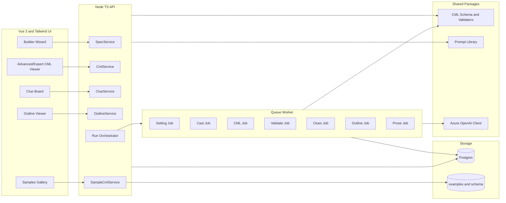

# Architecture and Backend Implementation

## Repository structure (monorepo)
- /apps/web (Vue 3 + Vite + Tailwind + Headless UI)
- /apps/api (Node/TS API + orchestrator)
- /apps/worker (queue workers)
- /packages/cml (shared schema + validators)
- /packages/prompts (agent prompts)
- /packages/utils (logging, retries, rate limits)
- /examples, /schema, /validation

## API surface

### Artifacts
- GET /api/projects/:id/cml/latest (Advanced/Expert only)
- POST /api/projects/:id/cml/validate (Advanced/Expert only)
- GET /api/projects/:id/cml/validation/latest (Advanced/Expert only)
- GET /api/projects/:id/setting/latest
- GET /api/projects/:id/setting/validation/latest
- GET /api/projects/:id/cast/latest
- GET /api/projects/:id/cast/validation/latest
- GET /api/projects/:id/clues/latest
- GET /api/projects/:id/clues/validation/latest
- GET /api/projects/:id/outline/latest
- GET /api/projects/:id/outline/validation/latest
- GET /api/projects/:id/character-profiles/latest
- GET /api/projects/:id/background-context/latest
- GET /api/projects/:id/hard-logic-devices/latest
- GET /api/projects/:id/prose/latest
- GET /api/projects/:id/prose/all
- GET /api/projects/:id/game-pack/latest
- GET /api/projects/:id/fair-play/latest
- GET /api/projects/:id/game-pack/pdf
- GET /api/projects/:id/prose/pdf (supports optional `?length=short|medium|long`)
- GET /api/projects/:id/synopsis/latest

### Projects
- POST /api/projects
- GET /api/projects
- GET /api/projects/:id

### Admin
- POST /api/admin/clear-store — clears JSON/Postgres persistence (projects, specs, artifacts, runs, logs)
- GET /api/llm-logs?projectId=&limit= — returns recent LLM log entries from the JSONL log file

### Export
- POST /api/projects/:id/export — Download a JSON file containing the latest version of selected artifacts (setting, cast, cml, clues, outline, fair_play_report, prose, game_pack). Accepts `{ artifactTypes: string[] }` in the body and returns a downloadable file. Used by the ExportPanel UI.

### Regenerate
- POST /api/projects/:id/regenerate — Regenerate a single artifact scope from the latest spec. Accepts `{ scope: string }` where scope is one of: setting, cast, cml, clues, outline, prose, game_pack, fair_play_report.
- LLM-only regeneration currently supports `character_profiles`; other scopes require a full pipeline run to ensure fresh LLM output.

### Samples
- GET /api/samples
- GET /api/samples/:name
  - returns sample metadata and raw YAML content from examples/ for community templates

### Logging
- POST /api/logs — Record UI or system activity logs (scope/message/payload).
- GET /api/logs?projectId=... — Retrieve logs for debugging.
- HTTP requests with status >= 400 are also recorded with scope `http_error`.
- Activity logs are also appended to `apps/api/logs/activity.jsonl` for file-based inspection.

## Access control (conceptual)
- `mode = user | advanced | expert`
- Default UI and APIs return friendly projections only.
- CML endpoints exist but are not used by default UI.
- Direct CML editing endpoints are Expert-only with explicit warnings.
 - Phase 1 API skeleton reads `x-cml-mode` header to gate CML endpoints.
 - Phase 2 adds a CML validation endpoint that stores a `cml_validation` artifact.

## Orchestration pattern
State machine with retries:
SPEC_READY → SETTING_DONE → CAST_DONE → HARD_LOGIC_DEVICES_DONE → CML_DRAFT → CML_VALIDATED → CHARACTER_PROFILES_DONE → CLUES_DONE → OUTLINE_DONE → PROSE_DONE

Current behavior:
- Run initiation creates a run record, sets project status to running, and starts the LLM pipeline.
- Artifacts are written as each LLM step completes; no deterministic stub artifacts are created.
- Pipeline execution requires Azure OpenAI credentials; no deterministic fallback artifacts are produced.
- Clue generation now includes a deterministic guardrail pass (essential clue placement, duplicate clue IDs, and detective-only clue phrasing checks) before fair-play auditing.
- Fair-play audit retries clues once; unresolved fair-play violations are recorded as warnings and pipeline execution continues.
- CML orchestration now runs a dedicated hard-logic ideation agent that generates a `hard_logic_devices` artifact (3–5 novel mechanism concepts), validates it against schema, and then grounds Agent 3 CML generation in those generated devices.
- Pipeline now also materializes a dedicated `background_context` artifact (era/setting/cast anchors/theme backdrop) so background context is stored separately from hard-logic mechanism ideation and consumed distinctly by Agent 3.
- Prose is sanitized before persistence/export (Unicode normalization, mojibake cleanup, system residue removal).
- Release gate now hard-fails runs when continuity-critical issues remain, mojibake remains, no discriminating test is realized, or suspect closure coverage is incomplete.

Phase 5 completion:
- Prose and character profile artifacts are LLM-generated after outline.
- Game pack artifact is generated deterministically (placeholder content) after outline.
- Game pack artifact is available via a dedicated API endpoint.

Artifact roles:
- **Canonical:** CML (always generated and stored).
- **Derived:** clues, outline, prose, character_profiles, and all friendly projections.
- **Prose versioning:** prose artifacts are stored by target length (`prose_short`, `prose_medium`, `prose_long`) so users can regenerate with different lengths and keep exportable versions.
- UI defaults to derived artifacts; CML is hidden unless Advanced/Expert mode is enabled.

Spec extensions:
- `castNames` (optional array or comma-separated string) is stored in the spec for future LLM conditioning; direct deterministic overrides are not used.

Derived friendly projections now include:
- `fair_play_report` (overall status, summary, checklist items, violations, warnings)
- `synopsis` (readable summary derived from CML)

PDF export notes:
- Story PDF generation sanitizes paragraph content to avoid invalid PDF text tokens (non-string values and embedded newlines are normalized).
- Story and game pack PDFs wrap long lines and paginate across multiple pages.
- Story and game pack PDFs render markdown-style headings for titles and sections.

## Prose + game pack (Phase 5)
- Prose generation is LLM output derived from outline and cast.
- Character profiles are LLM output derived from cast (target ~1000 words each).
- Game pack generation is planned and not yet available without LLM support.

Functional policies:
- One active run per project (queue additional runs)
- Regenerate scopes map to specific artifacts
- Retry policy by step with max attempts
- Partial failure behavior: rollback or keep last valid artifact

## Worker jobs
- settingJob
- castJob
- cmlJob
- validateCmlJob
- cluesJob
- outlineJob
- proseJob
- gamePackJob

Each job reads prior artifact, calls Azure OpenAI, validates output, writes new artifact version, emits SSE.

## Azure OpenAI integration
- Centralized client for model routing and telemetry
- Per-agent prompt templates and strict JSON output enforcement
- Retries, rate limits, and timeouts

## Data model (Postgres)
- projects(id, name, created_at)
- spec_versions(id, project_id, spec_json, created_at)
- artifact_versions(id, project_id, type, payload_json, created_at, source_spec_id)
- runs(id, project_id, status, started_at, finished_at)
- run_events(id, run_id, step, message, created_at)
- activity_logs(id, project_id, scope, message, payload_json, created_at)

## Database runtime (Postgres in Docker)
- Postgres is the primary datastore and is expected to run in Docker in local dev.
- Services connect via `DATABASE_URL` (preferred) or split `PG*` environment variables.
- The DB stores canonical CML, derived artifacts, versions, and run history.
- When `DATABASE_URL` is not set, the API uses a simple JSON file-backed repository (default `data/store.json`, override with `CML_JSON_DB_PATH`).
- The JSON file-backed repository writes directly to `store.json` with retry logic for missing directories and Windows file-lock errors (EPERM/EBUSY), and removes legacy `store.json.*.tmp` files at startup.

Provenance fields to add if needed:
- artifact_versions.prompt_version
- artifact_versions.model_name
- artifact_versions.parent_artifact_id
- artifact_versions.seed_ids
- artifact_versions.seed_patterns

## Diagrams
### Conceptual flow
```mermaid
flowchart TD
  U["User Inputs\nSetting Cast Logic Output Style"] --> S[MysterySpec]
  S --> CML["CML 2 0 Draft"]
  CML --> V["Validator\nSchema and Checklist"]
  V -->|Pass| CL["Clues and Red Herrings"]
  V -->|Fail| CML
  CL --> O[Outline]
  O --> P["Prose optional"]
  CML --> ADV["Advanced/Expert CML Viewer"]
  CL --> UI["Friendly Projections"]
  O --> UI
  P --> UI
  UI --> E["Exports and Play Kit"]

## Export packaging
- The backend supports packaging selected artifacts into a downloadable JSON file via the export API endpoint.
- The UI ExportPanel allows users to select which artifacts to include and triggers the download.
```

### Technical architecture

