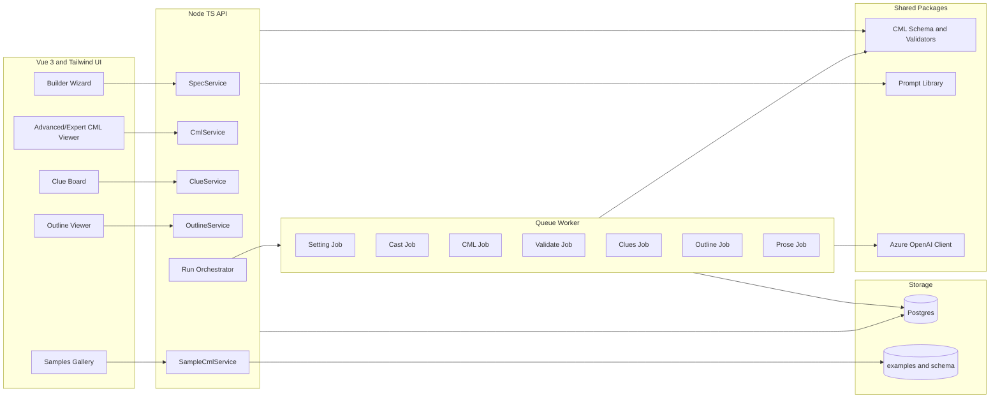

# Architecture and Backend Implementation

## Repository structure (monorepo)
- /apps/web (Vue 3 + Vite + Tailwind + Headless UI)
- /apps/api (Node/TS API + orchestrator)
- /apps/worker (queue workers)
- /packages/cml (shared schema + validators)
- /packages/prompts (agent prompts)
- /packages/utils (logging, retries, rate limits)
- /examples, /schema, /validation

## API surface

### Artifacts
- GET /api/projects/:id/cml/latest (Advanced/Expert only)
- POST /api/projects/:id/cml/validate (Advanced/Expert only)
- GET /api/projects/:id/cml/validation/latest (Advanced/Expert only)
- GET /api/projects/:id/setting/latest
- GET /api/projects/:id/setting/validation/latest
- GET /api/projects/:id/cast/latest
- GET /api/projects/:id/cast/validation/latest
- GET /api/projects/:id/clues/latest
- GET /api/projects/:id/clues/validation/latest
- GET /api/projects/:id/outline/latest
- GET /api/projects/:id/outline/validation/latest
- GET /api/projects/:id/character-profiles/latest
- GET /api/projects/:id/background-context/latest
- GET /api/projects/:id/hard-logic-devices/latest
- GET /api/projects/:id/prose/latest
- GET /api/projects/:id/prose/all
- GET /api/projects/:id/game-pack/latest
- GET /api/projects/:id/fair-play/latest
- GET /api/projects/:id/game-pack/pdf
- GET /api/projects/:id/prose/pdf (supports optional `?length=short|medium|long`)
- GET /api/projects/:id/synopsis/latest
- GET /api/projects/:projectId/runs/:runId/report
- GET /api/projects/:projectId/reports/history?limit=N
- GET /api/reports/aggregate
- GET /api/projects/:id/runs/latest

Report endpoint behavior:
- `GET /api/projects/:projectId/runs/:runId/report` now returns `202 { status: "in_progress", ... }` when the run is known and still active but the report file is not materialized yet.
- It returns `404` only when no report exists for a non-active/unknown run.
- If a requested run report is present but still marked `in_progress: true` after the run is no longer active, the endpoint does not return that snapshot as final output.
- In that idle/incomplete case, it returns the latest finalized project report with `stale: true` and `stale_reason: "incomplete_report"`; if no finalized fallback exists, it returns `409`.
- If a specific run report cannot be parsed/read but at least one valid report exists for the project, the endpoint returns the latest valid report with `stale: true` and `stale_reason: "report_read_error"`.

Latest-run endpoint behavior:
- `GET /api/projects/:id/runs/latest` returns `200 { run: null }` when a project has no runs yet (instead of `404`), so new-project UI flows can avoid noisy expected-error fetches.

### Projects
- POST /api/projects
- GET /api/projects
- GET /api/projects/:id

### Admin
- POST /api/admin/clear-store — clears JSON/Postgres persistence (projects, specs, artifacts, runs, logs)
- GET /api/llm-logs?projectId=&limit= — returns recent LLM log entries from the JSONL log file

### Export
- POST /api/projects/:id/export — Download a JSON file containing the latest version of selected artifacts (setting, cast, cml, clues, outline, fair_play_report, prose, game_pack). Accepts `{ artifactTypes: string[] }` in the body and returns a downloadable file. Used by the ExportPanel UI.
- Export now also supports `quality_report` (alias: `scoring_report`), which returns the latest stored `GenerationReport` for the project.
- Export also supports `narrative_state_trace`, which returns a flattened chapter-to-chapter NSD transfer trace from the latest quality report diagnostics.

`GenerationReport` now carries canonical run-status metadata in addition to score fields:
- `run_outcome` (`passed | failed | aborted`) and `run_outcome_reason`
- `scoring_outcome` and `release_gate_outcome` blocks for explicit status separation
- validation reconciliation fields (`validation_snapshots`, `validation_reconciliation`) for stage-aware issue accounting (`pre_repair`, `post_repair`, `release_gate`)

### Regenerate
- POST /api/projects/:id/regenerate — Regenerate a single artifact scope from the latest spec. Accepts `{ scope: string }` where scope is one of: setting, cast, cml, clues, outline, prose, game_pack, fair_play_report.
- LLM-only regeneration currently supports `character_profiles`; other scopes require a full pipeline run to ensure fresh LLM output.

### Samples
- GET /api/samples
- GET /api/samples/:name
  - returns sample metadata and raw YAML content from examples/ for community templates

### Logging
- POST /api/logs — Record UI or system activity logs (scope/message/payload).
- GET /api/logs?projectId=... — Retrieve logs for debugging.
- HTTP requests with status >= 400 are also recorded with scope `http_error`.
- Activity logs are also appended to `apps/api/logs/activity.jsonl` for file-based inspection.

## Access control (conceptual)
- `mode = user | advanced | expert`
- Default UI and APIs return friendly projections only.
- CML endpoints exist but are not used by default UI.
- Direct CML editing endpoints are Expert-only with explicit warnings.
 - Phase 1 API skeleton reads `x-cml-mode` header to gate CML endpoints.
 - Phase 2 adds a CML validation endpoint that stores a `cml_validation` artifact.

## Orchestration pattern
State machine with retries:
SPEC_READY → SETTING_DONE → CAST_DONE → HARD_LOGIC_DEVICES_DONE → CML_DRAFT → CML_VALIDATED → CHARACTER_PROFILES_DONE → CLUES_DONE → COVERAGE_GATE → FAIR_PLAY_AUDIT → BLIND_READER_CHECK → CML_RETRY_OR_PASS → OUTLINE_DONE → PROSE_DONE

Current behavior:
- Run initiation creates a run record, sets project status to running, and starts the LLM pipeline.
- Artifacts are written as each LLM step completes; no deterministic stub artifacts are created.
- Pipeline execution requires Azure OpenAI credentials; no deterministic fallback artifacts are produced.
- Clue generation now includes a deterministic guardrail pass (essential clue placement, duplicate clue IDs, and detective-only clue phrasing checks) before fair-play auditing.
- Fair-play audit retries clues once; unresolved fair-play violations are recorded as warnings and pipeline execution continues.
- **Deterministic coverage gate (implemented):** Five guardrail functions (inference path coverage, contradiction pairs, false assumption contradiction, discriminating test reachability, suspect elimination) run after clue extraction. Critical gaps trigger one Agent 5 retry before the fair-play audit.
- **Blind reader simulation (implemented):** After the fair-play audit, an LLM-only-clues simulation tests whether a reader can identify the culprit without seeing the solution. Failure triggers Agent 5 retry with blind reader feedback.
- **CML-level feedback loop (implemented):** Structural fair-play failures (abstract inference path, insufficient constraint space) escalate to Agent 4 CML revision, then re-run Agent 5 + Agent 6 on the revised CML.
- **Pipeline hard stop (implemented):** Persistent critical fair-play failures after CML retry abort the pipeline instead of producing an unsolvable mystery.
- **Cost circuit breaker (implemented):** Fair-play retry cost is capped at $0.15 to prevent runaway LLM spend.
- CML orchestration now runs a dedicated hard-logic ideation agent that generates a `hard_logic_devices` artifact (3–5 novel mechanism concepts), validates it against schema, and then grounds Agent 3 CML generation in those generated devices.
- Pipeline now also materializes a dedicated `background_context` artifact (era/setting/cast anchors/theme backdrop) so background context is stored separately from hard-logic mechanism ideation and consumed distinctly by Agent 3.
- Prose is sanitized before persistence/export (Unicode normalization, mojibake cleanup, system residue removal).
- API pipeline persistence now also writes a readable plain-text story file to `stories/project_*.txt` with consistent chapter/summary/paragraph spacing.
- Prose sanitation now strips illegal control characters while preserving valid multibyte Unicode text (UTF-8-safe output behavior).
- Worker prose post-processing now deterministically reflows dense paragraphs (unwrap + sentence-boundary splits) before validation/release checks.
- Worker prose post-processing now deterministically injects scene-grounding leads when chapter openings miss location anchor / sensory / atmosphere requirements.
- Worker prose post-processing now deterministically hardens template-leakage prevention by rotating grounding-lead phrasing, rewriting scaffold-signature paragraphs, and replacing repeated long boilerplate blocks across chapters before release checks.
- Worker prose sanitization now normalizes chapter titles by stripping duplicated `Chapter N:` prefixes before persistence/export.
- Release checks now include prose readability density and location-grounding coverage in addition to continuity/fair-play signals.
- Release gate now hard-stops when NSD indicates a clue was revealed but prose evidence extraction cannot anchor that clue (`revealed_without_evidence > 0`).
- Release gate now hard-stops completion when critical defects remain:
  - **Fair play audit score <60/100** (violations of Clue Visibility, Information Parity, or other critical fair play dimensions)
  - **Fair play 0-score violations** (any dimension scoring 0/100 is release-blocking)
  - Mojibake/encoding corruption
  - Template leakage (repeated scaffold blocks)
  - Temporal contradictions (month/season inconsistencies)
  - Unresolved placeholder-token leakage (severe)
  - Duplicate chapter-heading artifacts
  - Unresolved suspect-closure gaps
  - Non-critical readability/grounding issues continue as warnings for review
- Prose generation now injects baseline quality guardrails on every pass (canonical cast names only, suspect-elimination ledger coverage, and explicit culprit evidence chain), independent of retry state.
- Prose scoring adaptation now uses clue-semantic matching (from Agent 5 clue descriptions/points-to metadata) in addition to literal clue-ID matching, reducing false clue-visibility misses when prose surfaces clue content without printing internal IDs.
- Prose clue evidence extraction now emits unified per-clue states (`introduced`, `hinted`, `explicit`, `confirmed`) and persists them in NSD transfer/release diagnostics, aligning scorer visibility semantics with NSD clue progression telemetry.
- Prose clue expectation sourcing is now additive across CML clue mapping, clue distribution IDs, discriminating-test evidence clues, and clue registry IDs (when present), reducing false critical completeness failures caused by partial mapping-only expectations.
- Agent 9 post-generation/release-gate diagnostics now persist clue-visibility comparison sets (`expected` vs `extracted` clue IDs plus missing/unexpected deltas) to speed triage of completeness failures.
- Agent 9 retry guidance now includes explicit error-class micro-prompt directives for clue-visibility, word-count, and scene-grounding corrections.
- Agent 9 prompt assembly now enforces token-budget accounting per context block with deterministic truncation and priority-based pruning to keep prompts within limits without dropping critical constraint blocks.
- Prose generation now enforces a deterministic month/season lock from temporal context: prompt-level hard guardrails plus chapter-level normalization of conflicting season terms when a chapter references the locked month.
- Temporal contradiction validation now uses a shared contradiction-matrix analyzer in story validation (month-to-forbidden-season mapping plus normalized seasonal phrase detection such as `springtime`, `autumnal`, and `wintry`) and is applied consistently in both chapter-level and scene-continuity validators.
- **NarrativeState threading (implemented):** A `NarrativeState` document (`packages/prompts-llm/src/types/narrative-state.ts`) is initialised before prose generation (from lockedFacts + character gender map) and passed to every `generateProse` call. After each chapter batch, `updateNSD()` extracts opening-sentence style classes, sensory phrases, and chapter summaries. The updated state is injected into the next batch's system prompt via `buildNSDBlock()`, preventing style repetition and fact contradictions across batches.
- **NarrativeState in-call propagation hardening (implemented):** Agent 9 now maintains and updates an internal live NarrativeState snapshot after each committed batch, so prompt injection and template-linter context evolve in-step during a single prose call (not only in orchestrator telemetry callbacks).
- **Locked facts propagation (implemented):** `lockedFacts` from the primary hard-logic device are extracted in the orchestrator and propagated to: (a) `generateProse` as `proofLockedFacts` for system-prompt injection; (b) `StoryValidationPipeline.validate()` merged into the cml argument for `ProseConsistencyValidator` checking.
- **ProseConsistencyValidator (implemented):** New validator in `packages/story-validation/src/prose-consistency-validator.ts` runs as part of `StoryValidationPipeline`. Checks: (1) locked-facts values appear verbatim when evidence is described — critical if contradicted, major if absent; (2) pronoun drift for binary-gender characters — moderate severity. Runs after `CharacterConsistencyValidator` in the pipeline.
- Validation-driven prose repair now executes when story validation is `needs_revision` as well as `failed`, reducing avoidable release-gate hard-stops.
- Validation-driven full-prose repair now starts with a fresh NarrativeState baseline (locked facts + pronouns only), preventing stale opening-style tails from a failed first pass from biasing early repair chapters.
- Validation-driven prose repair now runs in chapter-granular mode (`batchSize=1`, up to 3 attempts per repair chapter) to localize failures and avoid expensive full-batch restarts.
- Agent 9 template-linter now supports a repair profile that softens opening-style entropy checks during early repair chapters (warm-up window + reduced threshold), while retaining paragraph-fingerprint and n-gram leakage protections.
- Validation-driven prose repair and release-gate suspect-elimination checks now share a unified classifier (type aliases + message fallback matching) so key-name drift cannot bypass repair guardrails.
- Agent 9 opening-style entropy enforcement now uses an adaptive threshold curve in standard mode (lower early, canonical later) and no longer hard-stops prose on entropy-only residual failures after retries.
- Fair-play failure-class selection now considers both deterministic coverage checks and critical fair-play audit rule signals (for example, Clue Visibility and Logical Deducibility) before choosing clue-only vs structural remediation paths.
- Identity continuity guardrail now performs chapter-targeted prose repair first (only chapters with role-alias drift) and falls back to full-prose regeneration only if targeted repair leaves unresolved drift.
- Validation retry wrapper now returns the actual last-attempt artifact after retry exhaustion (no extra post-failure regeneration call).
- Agent 9 batch validation telemetry now reports true batch-level retry counts (`batchesWithRetries`, `totalBatches`) when `batchSize > 1`, avoiding chapter-count overreporting in run history and warnings.
- Agent 2b/2c/2d schema validation now validates a telemetry-complete shape, eliminating false `cost` / `durationMs` missing-field failures in retry logs.
- Temporal-context scoring completeness now uses field-aware substantial checks (date/season semantics instead of flat word-count thresholds) plus optional-field richness scoring for fashion/seasonal activity depth.
- Worker path resolution for retry config, worker logs, and seed examples now resolves from workspace root (module-path based) instead of `process.cwd()`, preventing API-launched ENOENT path drift.
- Narrative clue pacing now has a deterministic repair gate before prose: when fewer than 60% of scenes carry clue IDs, the orchestrator programmatically backfills `cluesRevealed` from clue mappings/timelines before attempting another LLM outline retry.
- Deterministic clue repair respects `prose_requirements.clue_to_scene_mapping`, anchors essential clues at least once, avoids long no-clue streaks, and balances clue-bearing scenes across acts.
- Narrative outline retries now include an exact scene-count lock guardrail: retry outlines are rejected if total scenes or any act's scene count differs from the pre-retry baseline.
- Runtime schema validation coverage now includes setting, cast, narrative outline, and prose artifacts in the worker orchestration path.
- Narrative outline schema failures now trigger a one-shot schema-repair regeneration with targeted guardrails before the pipeline aborts.
- Cast design schema failures now trigger a one-shot schema-repair regeneration with targeted guardrails before the pipeline aborts.
- Prose schema failures now trigger a one-shot schema-repair regeneration with targeted guardrails before abort.
- Setting refinement schema failures now trigger a one-shot schema-repair regeneration before the pipeline aborts.
- Cast schema contract is aligned with runtime payload fields (`possibleCulprits`, `redHerrings`, `victimCandidates`, `detectiveCandidates`, `latencyMs`).

Phase 5 completion:
- Prose and character profile artifacts are LLM-generated after outline.
- Game pack artifact is generated deterministically (placeholder content) after outline.
- Game pack artifact is available via a dedicated API endpoint.

Artifact roles:
- **Canonical:** CML (always generated and stored).
- **Derived:** clues, outline, prose, character_profiles, and all friendly projections.
- **Prose versioning:** prose artifacts are stored by target length (`prose_short`, `prose_medium`, `prose_long`) so users can regenerate with different lengths and keep exportable versions.
- UI defaults to derived artifacts; CML is hidden unless Advanced/Expert mode is enabled.

Spec extensions:
- `castNames` (optional array or comma-separated string) is stored in the spec for future LLM conditioning; direct deterministic overrides are not used.

Derived friendly projections now include:
- `fair_play_report` (overall status, summary, checklist items, violations, warnings)
- `synopsis` (readable summary derived from CML)

PDF export notes:
- Story PDF generation sanitizes paragraph content to avoid invalid PDF text tokens (non-string values and embedded newlines are normalized).
- Story and game pack PDFs wrap long lines and paginate across multiple pages.
- Story and game pack PDFs render markdown-style headings for titles and sections.
- Story PDF title resolution uses prose title first, then synopsis title, then project name fallback.

## Prose + game pack (Phase 5)
- Prose generation is LLM output derived from outline and cast.
- Character profiles are LLM output derived from cast (target ~1000 words each).
- Game pack generation is planned and not yet available without LLM support.

Functional policies:
- One active run per project (queue additional runs)
- Regenerate scopes map to specific artifacts
- Retry policy by step with max attempts
- Partial failure behavior: rollback or keep last valid artifact

## Scoring and retry system
- Each agent phase is scored by a dedicated `PhaseScorer` producing a `PhaseScore` with four component scores: `validation_score`, `quality_score`, `completeness_score`, `consistency_score`.
- The authoritative pass/fail decision uses `passesThreshold()` from `packages/story-validation/src/scoring/thresholds.ts`, which requires **both** the composite total to meet the per-phase threshold **and** every component to meet its minimum (60/50/60/50).
- `executeAgentWithRetry()` in the worker orchestrator uses `ScoreAggregator.passesThreshold(score)` for retry decisions — **not** `score.passed` from the scorer — to ensure retry decisions are always consistent with the final quality report.
- When a phase fails due to component minimums rather than a composite score shortfall, `getFailedComponents()` produces the failure reason fed into the retry prompt.
- `apps/worker/logs/scoring.jsonl` now includes structured `phase_diagnostic` events for Agent 9 prose runs:
  - `post_generation_summary`: score outcome, component failures, batch retry counts/failure samples, upstream coverage context, and scoped prose metrics (`prose_duration_ms_first_pass`, `prose_duration_ms_total`, `prose_cost_first_pass`, `prose_cost_total`) plus pass accounting (`rewrite_pass_count`, `repair_pass_count`, `per_pass_accounting`). Also includes online anti-template linter counters (`template_linter_checks_run`, `template_linter_failed_checks`, `template_linter_opening_style_entropy_failures`, `template_linter_paragraph_fingerprint_failures`, `template_linter_ngram_overlap_failures`) and explicit fair-play component telemetry (`fair_play_all_clues_visible`, `fair_play_discriminating_test_complete`, `fair_play_no_solution_spoilers`, `fair_play_component_score`).
  - On aborted runs after prose starts, the orchestrator now writes a partial `post_generation_summary` snapshot (`metrics_snapshot: aborted_partial`) before saving the partial report, preventing empty-diagnostics failure reports.
  - `release_gate_summary`: release-gate reasons (warnings and hard-stops) plus readability, grounding, template-leakage, temporal-consistency, placeholder, fair-play status snapshots, and `nsd_visibility_divergence` (NSD-revealed clues vs prose-evidenced clues).
- The same prose diagnostics are now persisted in each `GenerationReport` under `diagnostics[]`, so `/api/projects/:projectId/runs/:runId/report`, report history, and quality-report exports carry the same root-cause context as runtime logs.
- Prose phase score breakdown now preserves first-pass chapter scores and a second-run chapter score series when full prose reruns occur (identity/schema/validation repair paths), so UI quality tables can show both runs explicitly.
- Prose scoring adapter fair-play detection is hardened: clue visibility now falls back to clue-distribution IDs when CML clue mapping is absent, discriminating-test completion uses multi-signal detection (regex + discriminating-test semantic tokens + evidence-clue reasoning cues), and spoiler detection uses explicit early-reveal language checks.
- Story-validation discriminating-test enforcement is componentized: a valid test now requires setup action, evidence usage, elimination logic, and explicit outcome declaration. Missing components are emitted as distinct validator errors with chapter/paragraph pointers for targeted remediation.
- Scene-grounding validation now enforces opening-block requirements: the first 1-2 paragraphs must include a named location anchor plus sensory and atmosphere/time signals. Missing opening elements are reported as explicit validator issues to drive targeted rewrites.
- Character consistency validation is expanded: cast aliases now resolve to canonical identities during mention checks, pronoun agreement validation carries into immediate follow-up sentence context, and titled out-of-cast named walk-ons are raised as explicit `illegal_named_walk_on` violations.
- Agent 9 prose generation now runs a provisional per-chapter scoring pass during batch validation and feeds chapter deficits forward as corrective directives in subsequent prompts, creating an in-run chapter N -> N+1 feedback loop before final phase scoring.
- `diagnostics[]` now also includes `nsd_transfer_trace` snapshots for Agent 9 batches (before/after NarrativeState tails, chapter-summary counts, newly revealed clue IDs, and per-clue evidence anchors) so chapter-to-chapter state handoff is auditable in exported quality reports.
- Report persistence now enforces a `GenerationReport` invariant gate (`validateGenerationReportInvariants`), rejecting contradictory payloads before storage (for example: `run_outcome=passed` with `passed=false` or any failed-phase signals, aborted runs without reason, template-linter abort reasons with zero `template_linter_failed_checks`, or NSD trace steps where revealed clue IDs lack matching evidence anchors).
- Replay fixtures for known bad runs are now tested in `@cml/story-validation` to prevent regression of report-contract contradictions.
- Fixed-seed prose benchmark replay tests are now part of `@cml/story-validation`, asserting deterministic Agent 9 chapter-level outcomes (phase total and per-chapter score signature) for selected report seeds.
- Prompt-variant A/B evaluation support is now included in `@cml/story-validation` via a paired-seed harness (`comparePromptVariants`) that only selects a winner when sample-size, effect-size, and paired sign-test significance gates are all satisfied.
- Agent 9 prose chapter score traces now carry component-level chapter metrics (`individual_validation_score`, `individual_quality_score`, `individual_completeness_score`, `individual_consistency_score`, plus cumulative counterparts), enabling dashboard-level per-chapter component trend analysis.
- Worker catastrophic-failure handling now sets canonical abort metadata via a single helper (`run_outcome=aborted`, `run_outcome_reason`) and keeps legacy `aborted`/`abort_reason` fields only through that compatibility shim.
- Cast agent (`agent2-cast`): `maxTokens` is 6000 (7 fully-detailed characters exceed 4000). The agent retries internally when fewer characters than requested are returned, when `possibleCulprits` is below `min(3, count-1)`, or when role-archetype diversity is below the scorer threshold (>=70% unique). On final attempt, a deterministic archetype-diversification fallback rewrites duplicate non-protected role labels to satisfy diversity targets; if diversity remains below threshold after fallback, the agent fails rather than returning a non-compliant cast.
- Fair-play audit retry: the audit runs twice (initial + 1 clue regeneration). If still failing, `classifyFairPlayFailure` determines the retry strategy: `inference_path_abstract` and `constraint_space_insufficient` trigger a CML structural revision (Agent 4); `clue_only` triggers a third targeted clue regeneration pass with per-violation feedback. The CML Validation Gate only hard-stops on structurally-blocking violations (`Clue Visibility`, `Logical Deducibility`, `No Withholding`); `Information Parity` and `Solution Uniqueness` are clue-phrasing issues that demote to warnings and allow prose to proceed.

## Worker jobs
- settingJob
- castJob
- cmlJob
- validateCmlJob
- cluesJob
- outlineJob
- proseJob
- gamePackJob

Each job reads prior artifact, calls Azure OpenAI, validates output, writes new artifact version, emits SSE.

## Azure OpenAI integration
- Centralized client for model routing and telemetry
- Per-agent prompt templates and strict JSON output enforcement
- Retries, rate limits, and timeouts

## Data model (Postgres)
- projects(id, name, created_at)
- spec_versions(id, project_id, spec_json, created_at)
- artifact_versions(id, project_id, type, payload_json, created_at, source_spec_id)
- runs(id, project_id, status, started_at, finished_at)
- run_events(id, run_id, step, message, created_at)
- activity_logs(id, project_id, scope, message, payload_json, created_at)

## Database runtime (Postgres in Docker)
- Postgres is the primary datastore and is expected to run in Docker in local dev.
- Services connect via `DATABASE_URL` (preferred) or split `PG*` environment variables.
- The DB stores canonical CML, derived artifacts, versions, and run history.
- When `DATABASE_URL` is not set, the API uses a simple JSON file-backed repository (default `data/store.json`, override with `CML_JSON_DB_PATH`).
- The JSON file-backed repository writes directly to `store.json` with retry logic for missing directories and Windows file-lock errors (EPERM/EBUSY), and removes legacy `store.json.*.tmp` files at startup.

Provenance fields to add if needed:
- artifact_versions.prompt_version
- artifact_versions.model_name
- artifact_versions.parent_artifact_id
- artifact_versions.seed_ids
- artifact_versions.seed_patterns

## Diagrams
### Conceptual flow
```mermaid
flowchart TD
  U["User Inputs\nSetting Cast Logic Output Style"] --> S[MysterySpec]
  S --> CML["CML 2 0 Draft"]
  CML --> V["Validator\nSchema and Checklist"]
  V -->|Pass| CL["Clues and Red Herrings"]
  V -->|Fail| CML
  CL --> O[Outline]
  O --> P["Prose optional"]
  CML --> ADV["Advanced/Expert CML Viewer"]
  CL --> UI["Friendly Projections"]
  O --> UI
  P --> UI
  UI --> E["Exports and Play Kit"]

## Export packaging
- The backend supports packaging selected artifacts into a downloadable JSON file via the export API endpoint.
- The UI ExportPanel allows users to select which artifacts to include and triggers the download.
```

### Technical architecture

```mermaid
flowchart LR
  subgraph Web["Vue 3 and Tailwind UI"]
    W1[Builder Wizard]
    W2[Advanced/Expert CML Viewer]
    W3[Clue Board]
    W4[Outline Viewer]
    W5[Samples Gallery]
  end

  subgraph API["Node TS API"]
    A1[SpecService]
    A2[CmlService]
    A3[ClueService]
    A4[OutlineService]
    A5[Run Orchestrator]
    A6[SampleCmlService]
  end

  subgraph Worker[Queue Worker]
    J1[Setting Job]
    J2[Cast Job]
    J3[CML Job]
    J4[Validate Job]
    J5[Clues Job]
    J6[Outline Job]
    J7[Prose Job]
  end

  subgraph Shared["Shared Packages"]
    P1["CML Schema and Validators"]
    P2[Prompt Library]
    P3[Azure OpenAI Client]
  end

  subgraph Storage[Storage]
    DB[(Postgres)]
    FS[(examples and schema)]
  end

  W1 --> A1
  W2 --> A2
  W3 --> A3
  W4 --> A4
  W5 --> A6
  A5 --> Worker
  Worker --> P3
  API --> DB
  A6 --> FS
  Worker --> P1
  Worker --> DB
  API --> P1
  API --> P2
```
