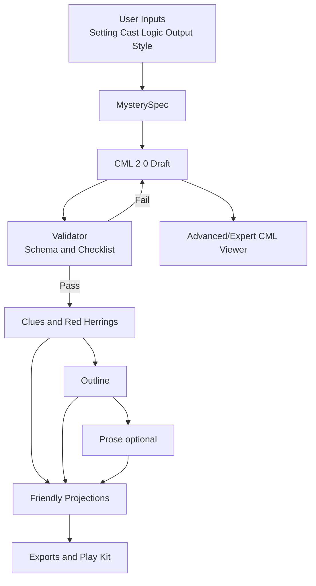

# Architecture and Backend Implementation

## Repository structure (monorepo)
- /apps/web (Vue 3 + Vite + Tailwind + Headless UI)
- /apps/api (Node/TS API + orchestrator)
- /apps/worker (queue workers)
- /packages/cml (shared schema + validators)
- /packages/prompts (agent prompts)
- /packages/utils (logging, retries, rate limits)
- /examples, /schema, /validation

## API surface
### Projects
- POST /api/projects
- GET /api/projects/:id

### Specs
- POST /api/projects/:id/specs
- GET /api/specs/:id

### Pipeline
- POST /api/projects/:id/run
- GET /api/projects/:id/status
- GET /api/projects/:id/events (SSE)
- GET /api/projects/:id/runs/latest
- GET /api/runs/:id/events

### Artifacts
- GET /api/projects/:id/cml/latest (Advanced/Expert only)
- POST /api/projects/:id/cml/validate (Advanced/Expert only)
- GET /api/projects/:id/cml/validation/latest (Advanced/Expert only)
- GET /api/projects/:id/setting/latest
- GET /api/projects/:id/setting/validation/latest
- GET /api/projects/:id/cast/latest
- GET /api/projects/:id/cast/validation/latest
- GET /api/projects/:id/clues/latest
- GET /api/projects/:id/clues/validation/latest
- GET /api/projects/:id/outline/latest
- GET /api/projects/:id/outline/validation/latest
- GET /api/projects/:id/prose/latest

### Samples
- GET /api/samples
- GET /api/samples/:name

## Access control (conceptual)
- `mode = user | advanced | expert`
- Default UI and APIs return friendly projections only.
- CML endpoints exist but are not used by default UI.
- Direct CML editing endpoints are Expert-only with explicit warnings.
 - Phase 1 API skeleton reads `x-cml-mode` header to gate CML endpoints.
 - Phase 2 adds a CML validation endpoint that stores a `cml_validation` artifact.

## Orchestration pattern
State machine with retries:
SPEC_READY → SETTING_DONE → CAST_DONE → CML_DRAFT → CML_VALIDATED → CLUES_DONE → OUTLINE_DONE → PROSE_DONE

Phase 2 placeholder behavior:
- Run initiation stores a stub CML, validation result, and placeholder artifacts for clues/outline/prose.
Phase 3 start:
- Setting/cast/CML/clues/outline deterministic artifacts are derived from the latest saved spec when present.
Phase 3 completion:
- Pipeline executes deterministic step order with run events and stores a novelty audit artifact (pass when no seeds selected).

Artifact roles:
- **Canonical:** CML (always generated and stored).
- **Derived:** clues, outline, prose, and all friendly projections.
- UI defaults to derived artifacts; CML is hidden unless Advanced/Expert mode is enabled.

Functional policies:
- One active run per project (queue additional runs)
- Regenerate scopes map to specific artifacts
- Retry policy by step with max attempts
- Partial failure behavior: rollback or keep last valid artifact

## Worker jobs
- settingJob
- castJob
- cmlJob
- validateCmlJob
- cluesJob
- outlineJob
- proseJob
- gamePackJob

Each job reads prior artifact, calls Azure OpenAI, validates output, writes new artifact version, emits SSE.

## Azure OpenAI integration
- Centralized client for model routing and telemetry
- Per-agent prompt templates and strict JSON output enforcement
- Retries, rate limits, and timeouts

## Data model (Postgres)
- projects(id, name, created_at)
- spec_versions(id, project_id, spec_json, created_at)
- artifact_versions(id, project_id, type, payload_json, created_at, source_spec_id)
- runs(id, project_id, status, started_at, finished_at)
- run_events(id, run_id, step, message, created_at)

## Database runtime (Postgres in Docker)
- Postgres is the primary datastore and is expected to run in Docker in local dev.
- Services connect via `DATABASE_URL` (preferred) or split `PG*` environment variables.
- The DB stores canonical CML, derived artifacts, versions, and run history.
- Phase 2 persistence: projects/specs/status/runs/artifacts use Postgres when `DATABASE_URL` is set; otherwise a temporary in-memory fallback is used.

Provenance fields to add if needed:
- artifact_versions.prompt_version
- artifact_versions.model_name
- artifact_versions.parent_artifact_id
- artifact_versions.seed_ids
- artifact_versions.seed_patterns

## Diagrams
### Conceptual flow

### Technical architecture

