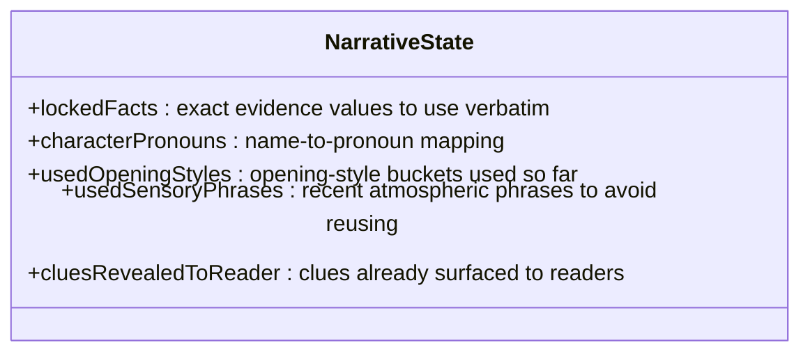
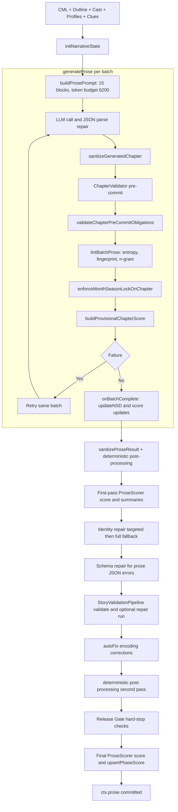
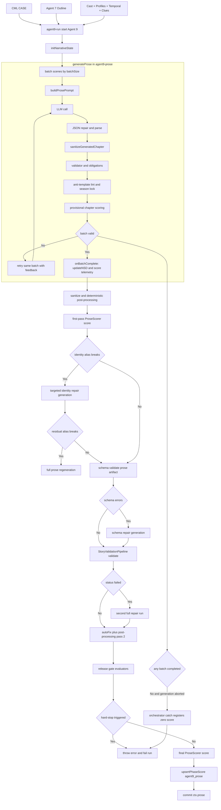

# Prose Generation — How It Works

This document explains exactly how Agent 9 generates the mystery's full narrative prose, from LLM prompt construction through to final scoring.

**Primary source files:**
- `apps/worker/src/jobs/agents/agent9-run.ts` — orchestration, repair, release gate, scoring
- `packages/prompts-llm/src/agent9-prose.ts` — prompt building, generation loop, per-batch linting
- `apps/worker/src/jobs/scoring-adapters/agent9-scoring-adapter.ts` — chapter → scorer adapter, fair-play timing
- `packages/story-validation/src/scoring/phase-scorers/agent9-prose-scorer.ts` — scoring rubric

---

## 1. Position in the Pipeline

Prose generation runs as Agent 9, the last major generation step. By the time it starts, the following upstream phases are complete and their outputs are available as context:

| Upstream output | Used for |
|---|---|
| CML (`CASE`) | Plot logic, culprit, clue-to-scene mapping, identity rules, fair-play requirements |
| Narrative outline (Agent 7) | Scene-by-scene structure: act, settings, `cluesRevealed`, purpose, dramatic elements |
| Cast design (Agent 2) | Character names, roles, archetypes, detection type |
| Character profiles (Agent 2b) | Speech patterns, personality, secrets — injected into prose prompts |
| Location profiles (Agent 2c) | Location names, sensory palettes, atmosphere — stripped of pre-written prose paragraphs before injection |
| Temporal context (Agent 3) | Month, season, fashion, cultural details, atmospheric touchstones |
| Clue distribution (Agent 5) | Full `Clue` objects with descriptions, categories, criticality, `supportsInferenceStep` |
| Hard logic / locked facts | Physical evidence values (times, distances, quantities) the prose must use verbatim |
| Fair-play audit | Pre-generation pass/fail that gates whether prose is structurally valid |

---

## 2. NarrativeState and NSD (Narrative State Diffing)

Before generation begins, `initNarrativeState()` creates a `NarrativeState` object that is threaded through every batch:

After each batch completes, `updateNSD()` diffs the new chapters against the existing state and advances it: new opening styles are recorded, revealed clue IDs are added to `cluesRevealedToReader`, newly used sensory phrases are appended. The next batch's prompt receives the updated state via the NSD block.

This prevents the LLM from recycling:
- Opening-style sentence patterns across chapters
- Sensory atmosphere phrases
- Clues already shown to the reader being re-introduced as revelations

The running `nsdTransferTrace` (stored on the context) is later compared against prose-extracted clue evidence to detect NSD-vs-evidence divergence in the release gate.

---

## 3. The Generation Loop

`generateProse()` in `agent9-prose.ts` drives the full chapter-by-chapter generation. The outline scenes are divided into batches (default `batchSize=1`; larger batches increase throughput at the cost of coarser retry granularity).

### Per-batch lifecycle

For each batch of `N` scenes (typically 1 scene = 1 chapter):

1. **Scene sanitization** — `sanitizeScenesCharacters()` removes phantom character names from all text fields (`summary`, `title`, `purpose`, `dramaticElements`) in the outline scenes passed to the LLM. Names not in the valid cast list are anonymized.

2. **Prompt assembly** — `buildProsePrompt()` assembles the system message from 15 prioritized context blocks (see §4). Token budgeting then trims or drops blocks by priority level.

3. **LLM call** — The prompt is sent to the configured model. Response is JSON-repaired if needed and parsed into `ProseChapter[]`.

4. **Chapter count validation** — The batch must return exactly the expected number of chapters.

5. **Chapter sanitization** — `sanitizeGeneratedChapter()` strips any invented `Title Surname` phrases from generated text.

6. **ChapterValidator pre-commit checks** — Before accepting a chapter, `ChapterValidator` (from `@cml/story-validation`) runs structural checks. Failures are compared against the requirement ledger.

7. **Pre-commit obligation validation** — `validateChapterPreCommitObligations()` checks:
    - Two-tier chapter word policy:
       - **Hard floor** = relaxed floor from `STORY_LENGTH_TARGETS.chapterMinWords * 0.9` (currently 720/1080/1350 for short/medium/long)
     - **Preferred target** = stricter prose density target (1300/1600/2400)
   - All required clue IDs for this scene are present in the text (by direct ID match or semantic token overlap)

   Behavior:
   - Below hard floor = hard failure (retry blocker)
   - Between hard floor and preferred target = soft miss (retry directive + telemetry, not immediate hard-stop)

8. **Anti-template linting** — `lintBatchProse()` runs 3 independent checks:
   - **Opening-style entropy**: Shannon entropy of the opening-sentence style window. If entropy falls below threshold (adaptive: 0.65 → 0.72 → 0.80 as chapter count grows), the batch is rejected.
   - **Paragraph fingerprinting**: Any normalized paragraph ≥170 chars that duplicates a prior chapter's fingerprint causes a rejection.
   - **N-gram overlap**: Jaccard similarity ≥ 0.60 between 6-grams of a new paragraph and any of the 25 most recent prior paragraphs causes a rejection.

9. **Temporal season enforcement** — `enforceMonthSeasonLockOnChapter()` scans chapters for conflicting season labels when a month is also mentioned. If the temporal context locks the story to (e.g.) November → winter, any mention of "summer" or "spring" in the same chapter is replaced in-place.

10. **Provisional chapter scoring** — `buildProvisionalChapterScore()` computes a lightweight score per chapter (35% word score, 20% paragraph score, 25% clue score, 20% issue penalty score). Low-scoring chapters produce `deficits` and `directives` that are injected into the next batch's prompt via the `provisional_scoring_feedback` block.

11. **Targeted underflow expansion (implemented)** — when the only hard blocker is chapter hard-floor underflow, Agent 9 runs a chapter-local expansion call that preserves chronology, clue obligations, and identity constraints, then re-validates the chapter before deciding batch fate.

12. **Retry** — If any hard validation or linting check still fails, the batch is retried from step 3 with accumulated error context fed back to the LLM. A batch that exhausts retries aborts the generation.

13. **`onBatchComplete` callback** — Once a batch is accepted, the callback fires. In `agent9-run.ts` this:
    - Advances `repairNarrativeState` via `updateNSD()`
    - Scores the batch alone (`ProseScorer.score(partialGeneration=true)`)
    - Scores all chapters accumulated so far (cumulative score)
    - Appends both to `proseChapterScores[]` for live quality-tab display
    - Calls `scoreAggregator.upsertPhaseScore("agent9_prose", ...)` to make the latest score visible in the UI
    - Calls `savePartialReport()` immediately

### Where/When LLM Calls Happen (explicit map)

Primary call site:
- `packages/prompts-llm/src/agent9-prose.ts` inside `generateProse()` per batch lifecycle step 3 (**LLM call**).

When this call is executed:
- Once per accepted batch in the normal first-pass generation.
- Again for the same batch on every retry attempt when pre-commit validation/linting fails.

Additional LLM-triggering paths from `apps/worker/src/jobs/agents/agent9-run.ts`:
- **Targeted identity repair:** re-invokes `generateProse()` on a chapter subset when alias-break violations are detected.
- **Full regeneration fallback:** re-invokes `generateProse()` on the full outline if targeted identity repair leaves residual violations.
- **Schema repair:** re-invokes prose generation for schema-failing chapters with schema-derived guardrails.
- **Story-validation repair run:** triggers a second full `generateProse()` pass when story validation status is `failed`.

What does **not** call the LLM:
- `onBatchComplete` scoring/reporting (`ProseScorer`, `scoreAggregator.upsertPhaseScore`, `savePartialReport`).
- Deterministic post-processing (`sanitizeProseResult`, `applyDeterministicProsePostProcessing`).
- Release-gate checks and diagnostics emission.

---

## 4. Prompt Construction

`buildProsePrompt()` assembles 15 context blocks with explicit priorities. Budgeting enforces a total of ≤ 6,200 tokens for the system message, dropping blocks in order: optional → medium → high. Critical blocks are never dropped.

| Block key | Priority | Content |
|---|---|---|
| `character_consistency` | critical | Name constraints, no invented titles, canonical references |
| `character_personality` | high | Per-character speech patterns, secrets, motivations (capped 900 tokens) |
| `physical_plausibility` | high | Era-appropriate physical constraints |
| `era_authenticity` | high | Period vocabulary, no anachronisms |
| `location_profiles` | medium | Names, types, sensory details, atmosphere — paragraphs stripped (capped 1,000 tokens) |
| `temporal_context` | medium | Month/season lock, fashion, cultural touchstones, month-season hard rule (capped 850 tokens) |
| `locked_facts` | critical | Verbatim physical evidence values — never contradict |
| `clue_descriptions` | critical | Full `Clue` objects for clues assigned to these scenes |
| `narrative_state` | critical | NSD block: locked facts, pronouns, used opening styles, used sensory phrases, already-revealed clues |
| `continuity_context` | medium | Character name list and setting vocabulary from all prior chapters (capped 500 tokens) |
| `discriminating_test` | critical | Explicit checklist when chapter is past 70% of story: test type, evidence clue IDs, eliminated suspects |
| `humour_guide` | optional | Structured guide to Golden Age restraint and dry wit (capped 850 tokens) |
| `craft_guide` | optional | Whodunnit emotional depth principles (capped 850 tokens) |
| `scene_grounding` | critical | Chapter-by-chapter checklist: location anchor, 2+ sensory cues, 1+ atmosphere marker |
| `provisional_scoring_feedback` | critical | Deficits and corrective directives from the two most recent low-scoring chapters, including preferred-target word-density misses |

The user message provides a structural case summary (title, era, setting, culprit, victim, cast) and the JSON-serialized scene outline for this batch. All scene text fields have already been sanitized of phantom names.

Additionally, four fair-play timing guardrails are always prepended to the quality guardrail block before other caller-supplied guardrails (repair guardrails are added by the repair run).

---

## 5. Text Sanitization

After `generateProse()` returns, `sanitizeProseResult()` and `applyDeterministicProsePostProcessing()` are applied before any further processing.

### `sanitizeProseText()` (per-paragraph)
1. Unicode NFC normalization
2. Mojibake replacement table (common Windows-1252 → UTF-8 mapping)
3. Dialogue punctuation normalization (smart quotes, ellipses, dashes)
4. Control character stripping (all `\x00–\x08`, `\x0b`, `\x0c`, `\x0e–\x1f`, `\x7f`)

### `applyDeterministicProsePostProcessing()` (whole-prose, applied twice: before and after story validation)
1. **Grounding lead injection**: For any chapter whose first 300 characters lack a named location anchor plus ≥2 sensory signals plus one atmosphere word, a synthetic lead sentence is prepended: `"In [location], [sensory1], and [sensory2]. [atmosphere]."` Location name comes from location profiles.
2. **Template leakage deduplication**: Any pair of long paragraphs (≥180 chars) with Jaccard similarity ≥ 0.70 across different chapters causes the second copy to be replaced with a scaffold stub that preserves chapter flow without repeating content.
3. **Chapter heading artifact removal**: Duplicate chapter heading strings embedded inside paragraph text are stripped.
4. **Long-paragraph splitting**: Paragraphs exceeding 2,400 characters are split at the nearest sentence boundary at or before 1,800 characters, with the remainder becoming a new paragraph.

---

## 6. Repair Passes

### Identity repair (targeted)
After first-pass scoring, `detectIdentityAliasBreaks()` scans all chapters for illegal role-only alias usage of the culprit post-reveal (e.g., "the killer said", "the murderer watched" in chapters after the culprit is named). If violations are found:

- **Targeted repair**: Chapters with violations are extracted via `buildNarrativeSubsetForChapterIndexes()` and fed back to `generateProse()` with identity-specific guardrails. Up to 40% of chapters can be targeted.
- **Full regeneration fallback**: If targeted repair still has residual violations, the entire prose is regenerated from scratch.

Costs and durations for repair passes are accumulated under `ctx.agentCosts["agent9_prose"]`.

### Schema repair
`validateArtifact("prose")` checks the generated chapters against the prose JSON schema. If schema errors are found, specific chapters are regenerated with guardrail directives derived from the schema error messages. A re-validate step confirms the fix.

### Story validation repair
After the `StoryValidationPipeline` runs a full-story validation, if the status is `"failed"`, a second full prose generation is triggered with up to several targeted guardrails:

- Discriminating test coverage guardrail (if `missing_discriminating_test` or `cml_test_not_realized`)
- Suspect closure coverage guardrail (if `suspect_closure_coverage_failure`)
- Culprit evidence chain guardrail (if `culprit_evidence_chain_coverage_failure`)
- Universal guardrails: no placeholder names, explicit suspect elimination in Act III, no chapter-to-chapter prose recycling

The repair run uses `batchSize=1` and an entropy linter in `repair` mode (relaxed thresholds, 3-chapter warm-up).

---

## 7. Story Validation Gate

`StoryValidationPipeline.validate()` runs a full-story consistency check against the CML. It checks:
- Identity continuity (no alias breaks, missing case transition bridges)
- Temporal contradictions
- Investigator role drift
- Discriminating test coverage
- Suspect elimination coverage
- Culprit evidence chain coverage

If the repair pass resolves validation to `"passed"` or `"needs_review"`, the story proceeds. If not, a warning is recorded but the story continues to the release gate (hard-stops are handled there).

After validation (and any repair), `validationPipeline.autoFix()` applies a final encoding-correction pass over all chapters.

---

## 8. Release Gate

The release gate runs after all repair passes and validation. It evaluates 10 distinct failure categories:

| Check | Hard stop? | Threshold |
|---|---|---|
| Fair-play audit score | Yes (if < 60 or any 0-score violation) | score < 60 or `fail` status check |
| Identity/continuity error types | No | `identity_role_alias_break`, `missing_case_transition_bridge`, `case_transition_missing` |
| Temporal contradiction | Yes | Any `temporal_contradiction` validation error |
| Mojibake remains | Yes | `persistentMojibakePattern` scan |
| Illegal control characters | Yes | `[\x00-\x08\x0b\x0c\x0e-\x1f\x7f]` scan |
| Missing discriminating test | No | `missing_discriminating_test` or `cml_test_not_realized` |
| Suspect elimination coverage | Yes | `suspect_elimination_coverage_failure` |
| Template leakage | Yes (severe) | Duplicate long paragraph blocks or scaffold matches detected |
| Temporal / seasonal contradiction | Yes | Month-season contradictions in prose text |
| Placeholder token leakage | Yes (severe only) | Role+surname patterns, standalone `[PLACEHOLDER]`, generic role phrases |
| Chapter heading artifacts | Yes | Duplicate heading text inside paragraph content |
| Sensory variety | No (warning only) | >40% of chapters reuse the same atmospheric phrases |
| Readability density | No | Dense chapters (>2,400 char paragraphs), undercount paragraphs (<3) |
| Scene grounding coverage | No | < 90% of chapters grounded (location anchor + sensory cues) |
| NSD/clue-visibility divergence | Yes (if NSD reveals have no evidence) | Clues marked revealed by NSD but no prose evidence anchor found |

Any hard-stop reason throws an error that aborts the run and causes the partial report to record a failing prose score.

Release gate telemetry is stored as the `release_gate_summary` diagnostic and the `failure_lineage` diagnostic (first failing chapter, error class breakdown, corrective attempt count, final blocking reason).

---

## 9. Scoring Integration

### ProseScorer rubric

The `ProseScorer.score()` method runs on the adapted `ProseOutput` object. The rubric weights are:

| Component | Weight | Pass threshold |
|---|---|---|
| Validation | 40% | ≥ 60 |
| Quality | 30% | ≥ 50 |
| Completeness | 20% | ≥ 60 |
| Consistency | 10% | ≥ 50 |

Overall: `total = validation×0.4 + quality×0.3 + completeness×0.2 + consistency×0.1`. `passed = no critical failures AND total ≥ 60`.

**Validation tests:**
- Chapters array exists (critical)
- All chapters present (2.0 weight); partial credit if within 2 of target
- Chapter structure valid ≥ 95% (1.5 weight)
- Discriminating test present (1.5 weight, critical)

**Quality tests:**
- Average prose quality (2.0 weight): word count, paragraph count ≥5, dialogue presence, sensory words, transitions
- Readability (1.0 weight): sentence count ≥20, sentence length variance, overly long sentences, paragraph balance

**Completeness tests:**
- Word count target (1.5 weight): vs. story-length-targets.ts min/max
- Clue visibility (1.5 weight): expected clue IDs are taken from `expected_clue_ids` when available (authoritative union from adapter), falling back to CML `CASE.prose_requirements.clue_to_scene_mapping` for backwards compatibility

`partialGeneration=true` behavior:
- Chapter-count and whole-story word-count tests are skipped mid-generation so incomplete batches are not penalized for not having all chapters yet
- Structure, quality, clue visibility, and consistency checks still run on available chapters

**Consistency tests:**
- Character name consistency (2.0 weight): coverage rate of cast member references
- Setting fidelity (1.5 weight): location profile names found in prose
- Fair play compliance (1.5 weight): D8 recalibrated to 35/35/15/15:
  - `all_clues_visible` → 35 pts
  - `discriminating_test_complete` → 35 pts
  - `no_solution_spoilers` → 15 pts
  - `fair_play_timing_compliant` → 15 pts (defaults to pass when absent, for backwards compatibility)

### Scoring adapter (`adaptProseForScoring`)

### Runtime configuration (single YAML)

Agent 9 prose tuning values are centrally configured from one YAML file:

- `apps/worker/config/generation-params.yaml`

This file now controls the primary Agent 9 runtime tuning surface, including:

- word-policy and underflow expansion knobs (hard-floor relaxation ratio, preferred chapter targets, default prose batch attempts, expansion hint sizing, expansion temperature/token cap)
- chapter-generation model knobs (`prose_model.temperature`, `prose_model.max_batch_size`)
- anti-template linter thresholds (entropy windows/thresholds, paragraph fingerprint minimum length, n-gram overlap settings)
- scoring-adapter clue/discriminating semantic thresholds and fair-play spoiler window ratio
- prose-scorer completeness thresholds for word-count low-band and clue-visibility pass/minor-gap cutoffs

Optional override path:

- Env var `CML_GENERATION_PARAMS_PATH`

Before `ProseScorer.score()` runs, `adaptProseForScoring()` converts raw `ProseChapter[]` into `ProseOutput`:

1. Runs `collectClueEvidenceFromProse()` to build `clues_present[]` per chapter using:
   - Canonical clue-ID matching across separator variants (`_`, `-`, space) to prevent namespace drift false negatives
   - Semantic token matching against clue-distribution metadata when available
   - Conservative multi-token clue-ID fallback signatures when distribution metadata is missing
2. Detects the discriminating test chapter using a three-signal combination:
   - Regex on discriminating prose verbs (`test`, `experiment`, `reconstruct`, `eliminat`, etc.)
   - Semantic token overlap against the CML discriminating test description (configurable ratio/minimum from YAML)
   - Evidence clue IDs present in chapter plus reasoning language
3. Builds `fair_play_validation`:
   - `all_clues_visible`: all known CML clue IDs appear in at least one chapter
   - `discriminating_test_complete`: at least one chapter is a discriminating test chapter
      - `no_solution_spoilers`: spoiler language is disallowed in the first configured fraction of chapters (`scoring_adapter.fair_play.spoiler_early_chapter_ratio`; default 50%)
   - `fair_play_timing_compliant` (D7): no clue is first revealed and deduced-from in the same chapter. Method: for each clue, find the chapter where it first appears (`firstRevealChapterById`); if that same chapter also contains detective conclusion language (`CONCLUSION_RE`), record a timing violation. Compliant = no violations.
4. Exposes `expected_clue_ids` on the adapted output as a canonicalized union of IDs from:
        - CML `prose_requirements.clue_to_scene_mapping`
        - Agent 5 clue distribution (`clueDistribution.clues[].id`)
        - CML discriminating-test evidence IDs
        - CML clue registry IDs

This prevents ID-namespace drift between detection and scoring (the historical 0/N clue-visibility failure mode).

### Live scoring during generation

Every `onBatchComplete` call:
1. Scores the current batch alone (`partialGeneration=true`)
2. Scores all chapters accumulated so far (cumulative)
3. Pushes both scores to `proseChapterScores[]`
4. Calls `scoreAggregator.upsertPhaseScore("agent9_prose", ...)` — UI reads this immediately
5. Saves partial report to disk

The quality tab displays:
- Individual chapter scores (one bar per chapter)
- Cumulative score trend as chapters accumulate
- Component metrics per chapter (`validation`, `quality`, `completeness`, `consistency`) for both first run and repair run
- If a second-run repair occurs, `breakdown.repair_chapter_scores[]` from the repair pass

### Zero-chapter abort handling

If chapter 1 fails all retries and the generation throws before any batch completes, `chaptersGenerated === 0` and `upsertPhaseScore` is never called from `onBatchComplete`. In the orchestrator's `catch` block, if prose had started (`proseScoringSnapshot.startedAtMs !== null`) but zero chapters completed, a zeroed `PhaseScore` (total=0, grade=F, passed=false) is registered for `agent9_prose` so the quality tab always shows the phase, even on total failure.

---

## 10. Diagnostics Stored

The following diagnostics are written to the scoring aggregator and appear in the quality report:

| Diagnostic key | Phase label | Content |
|---|---|---|
| `agent9_prose_post_generation_summary` | Prose Generation | First-pass score breakdown, repair flags, chapter count |
| `agent9_prose_release_gate_summary` | Release Gate | All release gate evaluator results, NSD divergence, clue visibility |
| `agent9_prose_failure_lineage` | Prose Generation | First failing chapter, error class list, corrective attempt count, final blocking reason |
| `agent9_prose_e5_prompt_fingerprints` | Prose Generation | Per-chapter prompt hash and section size map for regression tracing |

---

## 11. Data Flow Summary

---

## 12. Full Integrated Prose Diagram

---

## 13. Historical Error Catalog (All Stored Runs)

This section summarizes recurring prose-related failures found across stored report files in:
- `apps/api/data/reports/**/*.json`
- `validation/quality-report-run_*.json`

Notes on counting:
- Counts below are raw match occurrences in stored files.
- Some runs are mirrored in both `apps/api/data/reports` and `validation`, so duplicates are expected.

### Most frequent error signatures

| Error signature | Raw occurrences | Where it appears |
|---|---:|---|
| `Word count target` underflow (`Only N words`, `Only N,NNN words`, `words (low)`) | 180 | Prose scorer tests + phase summaries |
| `Components below minimum: completeness` | 37 | `agent9_prose` failure reason / summary |
| `Only N/M clues` (often `0/N`) | 30 | Completeness test: clue visibility |
| `Only N/M chapters` | 22 | Validation test: chapter count completeness |
| `word count below minimum (chapter pre-commit)` | 12 | `run_outcome_reason` / `abort_reason` |
| `opening block lacks a clear named location anchor` | 8 | Chapter validator pre-commit failures |
| `opening-style entropy too low` | 8 | Template linter abort paths |
| `Character name ... not found in CML cast` | 8 | Chapter validator cast-consistency aborts |
| `CML validation failed before prose generation` | 7 | Pre-prose hard gate (`abort_reason`) |
| `Prose aborted before any chapter completed` | 4 | Agent9 failure reason |
| `Discriminating test has no evidence clues` | 3 | Pre-prose structural gate |
| `Discriminating test not found in any chapter` | 2 | Prose validation test failure |

### Why these are hard to fix in practice

1. Multi-gate failure stack
- Failures can occur at three different layers: pre-prose CML gate, per-chapter pre-commit gate, and post-generation scorer/release gate.
- A fix at one layer often only reveals the next blocker in the next run.

2. Early-chapter hard-stop amplification
- Many aborts happen at Chapter 1 (`opening anchor` + `word count below minimum`).
- With low retry budgets, a single stubborn Chapter 1 failure prevents any downstream recovery logic from running.

3. Coupled constraints in one retry window
- The same retry attempt frequently must satisfy multiple constraints simultaneously (location grounding, cast-name validity, word minimum, anti-template entropy).
- Improving one axis can still fail the batch on another axis, producing repeated aborts that look "unchanged".

4. Historical ID-namespace drift effects
- The recurring `Only 0/N clues` / completeness failures align with historical clue-ID mismatch between detection IDs and scorer-expected IDs.
- Even when prose contained clue evidence semantically, scoring could still report zero visibility.

5. Structural upstream blockers
- Pre-prose gate failures (`Fair play audit failed`, `Discriminating test has no evidence clues`) are not prose-writing defects.
- They require CML structure correction upstream, so Agent 9 retries cannot resolve them.

6. Signal duplication complicates diagnosis
- The same root failure is often repeated across `run_outcome_reason`, `failure_reason`, `abort_reason`, and summary arrays.
- Mirrored storage in two report locations further inflates apparent incidence unless deduplicated by `run_id`.

### Practical interpretation

- The dominant long-run failure class is **completeness** (word-count and clue-visibility underperformance).
- The dominant catastrophic abort class is **Chapter 1 pre-commit failure** (grounding + minimum-length + retry exhaustion).
- The dominant non-prose blocker is **upstream CML structural invalidity** (fair-play/discriminating-test prerequisites), which must be fixed before prose generation can succeed.
