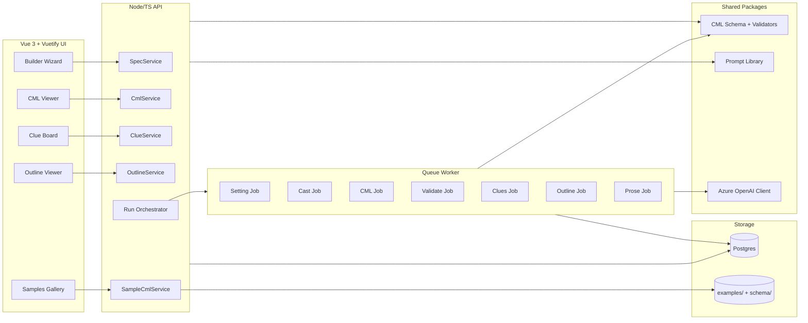

# Multi-agent Node.js Golden Age Whodunit Builder (CML-first)

Below is a concrete plan for a multi-agent Node.js web app where users “make their own” Golden Age whodunit by configuring setting/cast/tone—and the system generates a **CML-first** mystery (then story/chapter outline/clue sheets) driven by AI.

I’m going to treat **CML as your single source of truth**: everything (clues, chapters, solutions, handouts) is derived from it, so the mystery stays fair and consistent.

---

## 1) Product vision: “CML-first mystery builder”

**User promise:** pick a few knobs → get a playable Golden Age whodunit with:

- Setting bible (place/period/social rules)
- Cast list (roles, secrets, alibis)
- Crime + solution
- Clue sheet (fair-play)
- Chapter outline (or full prose)
- Optional “game mode” (host packet + suspect cards)

**Key design principle:**  
CML is generated first, validated, then used to generate prose. This prevents “cool story, broken logic.”

**Pipeline requirement (from CML 2.0):**  
Spec → CML → Validate → Clues → Outline → Prose. Never reverse this order.

**Source-awareness principle:**  
The system must be aware of sample CMLs in the project directory. These now exist under examples/ and should be discoverable, indexable, and usable as optional seeds/examples for generation and validation.

---

## 2) What should be configurable (the good knobs)

### A) Setting knobs (high impact, low complexity)

- Decade: 1930s / 1940s / 1950s (impacts tech, policing, gender norms, travel, communications)
- Country/region flavor: English country house / Scottish island / London club / Riviera hotel / Transatlantic liner / rural village / theatre troupe
- Weather/season: affects footprints, travel delays, gatherings, power cuts
- Social structure: aristocracy vs nouveau riche vs working-class household vs wartime austerity vs post-war modernity
- Institutional backdrop: estate, boarding house, hospital charity, publisher, museum, manor, school, regiment club

**Why this matters:** Golden Age puzzles depend on what’s “normal” in that world (letters, telegrams, servants, timetables, propriety).

### B) Cast knobs (must-have)

Let users choose a cast size and a role palette.

**Roles (configurable):**

- Victim archetype: tyrant, blackmailer, beloved benefactor, corrupt patriarch, glamorous scandal figure
- Detective type: amateur sleuth, retired inspector, doctor, journalist, spinster, barrister, butler(!)
- Suspect roles: spouse, heir, secretary, doctor, companion, valet/maid, business partner, neighbor, rival, family friend, ex-lover, solicitor

**Character constraints (configurable):**

- Relationship graph presets (love triangle, inheritance web, business fraud ring, secret child, wartime history)
- “Secret intensity”: mild embarrassments vs felony-level secrets
- “Motive distribution”: single strong motive vs many plausible motives

**Important:** provide an “Avoid stereotypes” toggle and let users choose diversity and tone safely.

### C) Crime logic knobs (this is your differentiator)

This is where you outclass generic story generators.

**Primary axis (one must be chosen):**

- Temporal (false timeline)
- Spatial (access illusion; not necessarily locked-room)
- Identity (mistaken identity, impersonation, forged letters, body mis-ID)
- Behavioral (habit targeting; “spoon not cup”)
- Authority/narrative (witness certainty is wrong; planted explanation)

**Delivery mechanism families (choose 1–2):**

- Poison (ingestion vs contact vs interaction)
- Staging (damage implies intrusion, suicide note implies intent)
- Object routing (shared implement; swapped item)
- Social engineering (who is believed; coerced statement; rumor trap)

**Fair-play constraints (highly recommended):**

- “All clues visible” mode
- “No supernatural / no impossible tech for decade”
- “No deus ex forensic lab unless decade supports it”
- “Solution deducible without detective-only information” toggle

**Clue density & texture:**

- Sparse (classic Christie tight)
- Medium (balanced)
- Rich (more clues, more handouts)

**Red herring budget:**

- 0–2 light misleads (clean)
- 3–5 (classic)
- 6–8 (noisy, riskier)

### D) Format knobs (output choices)

- Output type: outline, chapter beats, full novel chapters, playable party kit
- POV: detective / rotating witnesses / third-person
- Tone: cozy / satirical / bleak / romantic undertone / comedic
- Violence level: off-page / mild / explicit (keep within “cozy” defaults)
- Length: short story / novella / full novel plan
- Writing style capture: user-provided style sample or style descriptor (used only for prose)

---

## 3) Data model: your “MysterySpec”

Create a normalized spec the UI edits. It feeds the agents. The spec should map cleanly to the CML 2.0 schema.

Example shape:

```ts
type MysterySpec = {
  decade: "1930s"|"1940s"|"1950s";
  locationPreset: "CountryHouse"|"SeasideHotel"|"Village"|"Liner"|"Theatre";
  tone: "Cozy"|"Classic"|"Dark";
  cast: { size: number; roles: string[]; relationshipPreset: string; secretIntensity: string; };
  logic: {
    primaryAxis: "temporal"|"spatial"|"identity"|"behavioral"|"authority";
    mechanismFamilies: string[];
    fairPlay: { allCluesVisible: boolean; noModernTech: boolean; };
    clueDensity: "sparse"|"medium"|"rich";
    redHerringBudget: number;
  };
  outputs: { format: string[]; chapters?: number; };
  style?: { mode: "sample"|"descriptor"; text: string; guardrails?: string[] };
};
```

### CML 2.0 schema alignment (required)
Use the canonical schema at schema/cml_2_0.schema.yaml and generate CML that conforms to it:

- CML_VERSION must be 2.0
- Required top-level sections: meta, surface_model, hidden_model, false_assumption, constraint_space, inference_path, discriminating_test, fair_play
- Exactly one false_assumption.type (allowed: temporal, spatial, identity, behavioral, authority)
- discriminating_test.method allowed: reenactment, trap, constraint_proof, administrative_pressure
- crime_class.category allowed: murder, theft, disappearance, fraud

If you need additional categories or test methods (e.g., “assault” or “mechanical_demonstration” in samples), explicitly update/extend the schema or normalize these to allowed values.

---

## 4) Multi-agent architecture (what each agent does)

### Agent 1 — Era & Setting Agent
**Input:** decade + location preset  
**Output:** “Setting Bible” constraints:
- travel/communication limits
- policing practices
- technology availability
- social norms affecting access and alibis

This prevents anachronisms and drives believable constraints.

### Agent 2 — Cast & Motive Agent
**Input:** cast size + roles + relationship preset  
**Output:** cast list with:
- private secrets
- public persona
- motive seeds (not yet culprit)
- “access plausibility” notes (who can touch what)

### Agent 3 — Crime Designer Agent (CML generator)
**Input:** setting constraints + cast + logic knobs  
**Output:** a draft CML (CML 2.0 compliant):
- meta (title/author/license/era/setting/crime_class)
- surface_model (narrative, accepted_facts, inferred_conclusions)
- hidden_model (mechanism, delivery_path, outcome)
- false_assumption (statement/type/why_it_seems_reasonable/what_it_hides)
- constraint_space (time/access/physical/social)
- inference_path (ordered observation → correction → effect steps)
- discriminating_test (method/design/knowledge_revealed/pass_condition)
- fair_play (all_clues_visible/no_special_knowledge_required/no_late_information/reader_can_solve/explanation)

This agent must produce one primary axis.

### Agent 4 — CML Validator Agent (the “referee”)
**Input:** CML + spec  
**Output:** pass/fail + corrections:
- schema validation against CML 2.0
- checklist validation using validation/VALIDATION_CHECKLIST.md
- detects contradictions (“alibi impossible”, “clue not observable”)
- checks fair-play toggles
- ensures decade realism
- ensures discriminating test relies on knowledge/constraints, not confession

This agent is critical. It turns “AI storytelling” into “AI puzzle construction.”

### Agent 5 — Clue & Red Herring Agent
**Input:** validated CML + clue density + red herring budget  
**Output:**
- clue list grouped by category (time/access/object/behavior/testimony)
- red herrings that support the false assumption but don’t break fairness
- what each clue points to (without revealing too early)

### Agent 6 — Narrative Outliner Agent
**Input:** validated CML + clues + cast  
**Output:** chapter outline (Acts I–III, or 8-part beats)
- ensures each essential clue appears on-page before reveal
- places “discriminating test” late Act II / early Act III

### Agent 7 — Prose Writer Agent
**Input:** outline + style knobs  
**Output:** prose chapters (optional)
- never allowed to alter CML facts
- only allowed to dramatize within constraints
- uses `style` input to match tone/voice without copying copyrighted text

### Agent 8 — Game Pack Agent (optional)
**Input:** CML + cast  
**Output:** printable/usable assets:
- suspect cards
- host solution packet
- timeline sheet
- clue handouts

---

## 5) Orchestration pattern (Node.js)

### Use a state machine / graph, not a linear chain

Because you need loops:
- Generate CML → validate → revise → validate again
- Generate clues → validate clues don’t introduce new facts → revise

In Node/TS, implement a simple orchestrator:

**JobState:**  
SPEC_READY → SETTING_DONE → CAST_DONE → CML_DRAFT → CML_VALIDATED → CLUES_DONE → OUTLINE_DONE → PROSE_DONE

Each state writes artifacts to DB.

You can do this with:
- a queue (BullMQ) for background jobs
- websockets/SSE to stream progress + partial artifacts to the UI

---

## 6) Website architecture (practical)

### Frontend (required)
- Vue 3 (Composition API) with a modern build tool (e.g., Vite)

**Pages:**
- Builder (wizard + live preview)
- CML Viewer (structured, collapsible YAML)
- Clue Board (graph view of suspects ↔ clues)
- Exports (PDF/doc download later)

### Backend
- Node/TS API service (Express/Fastify) for orchestration and persistence
- Queue worker process for agents (separate from web server)

### AI integration (required)
- Use Azure OpenAI APIs for all model calls
- Centralize model access behind a single service layer to enforce:
  - rate limiting, retries, timeouts
  - model selection per agent
  - logging of prompts/outputs for traceability

### Storage
- Postgres (mystery projects, versions, artifacts)
- Object storage for generated files (zip/pdf later)

### Sample CML awareness
- Add a “sample CMLs” loader that scans examples/
- Current samples include:
  - a_study_in_scarlet_cml2.yaml
  - the_leavenworth_case_cml2.yaml
  - the_moonstone_cml2.yaml
  - the_mysterious_affair_at_styles_cml2.yaml
  - the_mystery_of_the_yellow_room_cml2.yaml
  - the_second_key.cml.yaml
  - the_sign_of_the_four_cml2.yaml
  - the_valley_of_fear_cml2.yaml
- Use samples as optional starters, regression tests, and schema conformance exemplars
- Flag any sample deviations from schema (e.g., category/method) and normalize or extend schema explicitly

### Versioning (important)
Every generation creates a version:
- spec_v3
- cml_v3
- clues_v3
- outline_v3

So users can roll back if a generation goes weird.

---

## 7) “CML-driven UX” (what makes it fun)

### Make CML visible but friendly
Most users don’t want YAML, but they do want control.

So show:
- “What everyone believes” (surface crime)
- “What’s actually true” (hidden structure) — locked behind spoiler toggle
- “The key mistaken assumption” (false assumption)
- “Fair-play checklist” (green ticks)

### Provide “regenerate” buttons at the right granularity
- Regenerate only cast secrets
- Regenerate only red herrings
- Regenerate only setting flavor text
- Regenerate only prose, locked to same CML

This is huge for creative control.

---

## 8) Quality controls that prevent bad mysteries

### Hard rules enforced by Validator Agent
- Exactly one primary axis
- Solution doesn’t require info absent from clue list
- No decade anachronisms
- Discriminating test is logical (knowledge/constraint-based), not confession-based
- Red herrings don’t contradict core constraints

### Automated checks (non-AI)
Build simple deterministic validators too:
- timeline windows must overlap plausibly
- “access set” includes culprit at required window
- clue count meets density setting
- all “load-bearing” clues appear before reveal in outline

---

## 9) What to build first (MVP → V1 → V2)

### MVP (2–4 weeks of focused build)
- Wizard UI for Spec
- Generate: Setting → Cast → CML → Validate → Outline
- Show: CML + Outline + spoiler toggle
- Export: ZIP with .yaml and .txt outline

### V1
- Clue list + red herring injection
- “Fair-play report”
- Regenerate granular components
- Simple suspect cards

### V2
- Full prose generation
- Printable party kit (PDF)
- “Play Mode”: reveal clues by chapter / scene
- Community templates (“Riviera 1937 Poisoner”, etc.)

---

## 10) How CML “drives” everything (the core loop)

- User config → MysterySpec
- Agents generate CML
- Validator forces consistency
- Everything else is derived:
  - clues (from constraints + false assumption)
  - outline (clue placement)
  - prose (skin on skeleton)
  - game assets (role packets)

This gives you a system that scales and stays coherent.

---

## 11) UI spec (Vue 3 + Vuetify 3)

**CSS framework choice:** Vuetify 3 (Material Design) for fast, consistent UI with strong accessibility defaults and robust Vue 3 integration.

### Design system
- Typography: 2–3 sizes (H1/H2/body), clear hierarchy
- Color tokens: primary/secondary, success/warn/error, neutral scale
- Spacing: 4/8/12/16/24/32 px rhythm
- Cards for artifacts, steppers for flow, chips for axes/tags

### Core layout
- App shell: left rail (navigation), top bar (project/status), main content
- Right drawer: “CML quick view” + validation status + last run
- Responsive: single-column wizard on small screens, two-panel on desktop

### Primary screens
1) **Project Dashboard**
  - Create/clone project
  - Recent versions (spec/cml/clues/outline)
  - Quick actions: regenerate, export

2) **Builder Wizard** (stepper)
  - Step 1: Setting
  - Step 2: Cast
  - Step 3: Logic
  - Step 4: Output
  - Live preview card showing: title, axis, cast size, clue density
  - Validation hints inline (from checklist)

3) **CML Viewer**
  - Collapsible tree view (YAML/JSON toggle)
  - Spoiler toggle to hide hidden_model and false_assumption
  - Schema validation status badge

4) **Clue Board**
  - Table + filters by category (time/access/physical/social)
  - Toggle to show red herrings
  - “Points-to” column with spoiler protection

5) **Outline Viewer**
  - Act/Chapter list with clue placement indicators
  - Warnings if load-bearing clues appear after reveal

6) **Samples Gallery**
  - Cards for examples/ CMLs
  - “Seed from sample” button
  - Diff view against generated CML (optional)

### Key components
- `SpecStepper`
- `CmlTreeView`
- `ValidationChecklistPanel`
- `ArtifactVersionTimeline`
- `ClueTable`
- `OutlineTimeline`
- `SampleCard`

### UX behaviors
- Non-blocking validations: show warnings as you edit, but allow proceed
- Regenerate granularity buttons (setting/cast/clues/outline/prose)
- Progress streaming (SSE) with step-by-step statuses
- Undo/rollback to previous version

### Accessibility & safety
- All interactive controls keyboard navigable
- Contrast-compliant themes
- Spoiler-safe defaults (hidden_model collapsed by default)

---

## 11.5) Diagrams (conceptual + technical)

### A) Conceptual flow (CML-first)

```mermaid
flowchart TD
  U[User Inputs
  (Setting/Cast/Logic/Output/Style)] --> S[MysterySpec]
  S --> CML[CML 2.0 Draft]
  CML --> V[Validator
  (Schema + Checklist)]
  V -->|Pass| CL[Clues & Red Herrings]
  V -->|Fail| CML
  CL --> O[Outline]
  O --> P[Prose (optional)]
  CML --> UI[CML Viewer]
  CL --> UI
  O --> UI
  P --> UI
  UI --> E[Exports/Play Kit]
```

### B) Technical architecture



---

## 12) Detailed implementation blueprint (structure + code)

### A) Repository structure (monorepo)
- /apps/web (Vue 3 + Vite + Vuetify)
- /apps/api (Node/TS API + orchestrator)
- /apps/worker (queue worker for agents)
- /packages/cml (shared CML types, schema, validators)
- /packages/prompts (agent prompts, versioned)
- /packages/utils (logging, retry, rate-limit helpers)
- /examples (sample CMLs)
- /schema (CML 2.0 schema)
- /validation (validation checklist)

### B) Backend modules (apps/api)
**Core services**
- `SpecService` — create/update MysterySpec, validate input ranges
- `CmlService` — generate, validate, store CML
- `ClueService` — derive clues, red herrings
- `OutlineService` — outline from CML+clues
- `ProseService` — optional prose generation
- `SampleCmlService` — load/parse examples from examples/

**Orchestrator**
- `Orchestrator.run(specId, steps[])`
- Each step writes artifacts to DB with versioning and emits SSE events

**Azure OpenAI client**
- `AzureOpenAIClient` wraps all calls (model selection, retries, telemetry)
- Supports per-agent system prompt + tool policy

### C) Worker modules (apps/worker)
- `jobs/settingJob.ts`
- `jobs/castJob.ts`
- `jobs/cmlJob.ts`
- `jobs/validateCmlJob.ts`
- `jobs/cluesJob.ts`
- `jobs/outlineJob.ts`
- `jobs/proseJob.ts`
- `jobs/gamePackJob.ts`

Each job reads previous artifact, calls Azure OpenAI, validates output, stores new version.

### D) API surface (apps/api)
**Projects**
- `POST /api/projects` → create project
- `GET /api/projects/:id` → project detail

**Specs**
- `POST /api/projects/:id/specs` → create spec version
- `GET /api/specs/:id` → spec detail

**Generate / Orchestrate**
- `POST /api/projects/:id/run` → run pipeline steps
- `GET /api/projects/:id/status` → current job state
- `GET /api/projects/:id/events` → SSE progress stream

**Artifacts**
- `GET /api/projects/:id/cml/latest`
- `GET /api/projects/:id/clues/latest`
- `GET /api/projects/:id/outline/latest`
- `GET /api/projects/:id/prose/latest`

**Samples**
- `GET /api/samples` → list sample CMLs from examples/
- `GET /api/samples/:name` → load sample CML

### E) Data model (Postgres)
- `projects(id, name, created_at)`
- `spec_versions(id, project_id, spec_json, created_at)`
- `artifact_versions(id, project_id, type, payload_json, created_at, source_spec_id)`
- `runs(id, project_id, status, started_at, finished_at)`
- `run_events(id, run_id, step, message, created_at)`

Artifacts types: setting, cast, cml, cml_validation, clues, outline, prose, game_pack.

### F) CML validation logic (packages/cml)
**Schema validation**
- Parse schema/cml_2_0.schema.yaml
- Validate output against schema before storing

**Checklist validation**
- Implement checks from validation/VALIDATION_CHECKLIST.md
- Store results as `cml_validation` artifact

**Normalization layer**
- Map non-canonical sample fields to schema-safe values if needed
- Log warnings when normalization occurs

### G) Agent prompt contracts (packages/prompts)
Each agent prompt must:
- accept strict JSON input
- produce strict JSON output matching expected artifact shape
- include explicit “do not invent new facts” constraints
- declare CML_VERSION = 2.0 when generating CML

---

## 13) Detailed UI implementation plan (Vue 3 + Vuetify 3)

### A) Frontend structure (apps/web)
- /src/views
  - `ProjectDashboard.vue`
  - `BuilderWizard.vue`
  - `CmlViewer.vue`
  - `ClueBoard.vue`
  - `OutlineViewer.vue`
  - `SamplesGallery.vue`
- /src/components
  - `SpecStepper.vue`
  - `SettingForm.vue`
  - `CastForm.vue`
  - `LogicForm.vue`
  - `OutputForm.vue`
  - `CmlTreeView.vue`
  - `ValidationChecklistPanel.vue`
  - `ClueTable.vue`
  - `OutlineTimeline.vue`
  - `ArtifactVersionTimeline.vue`
  - `SampleCard.vue`
  - `SpoilerToggle.vue`
  - `RunStatusBanner.vue`
- /src/stores
  - `projectStore.ts`
  - `specStore.ts`
  - `artifactStore.ts`
  - `runStore.ts`
- /src/services
  - `api.ts` (axios client)
  - `sse.ts` (event stream handling)

### B) Form fields (spec inputs)
**SettingForm**
- decade (select)
- locationPreset (select)
- weather (select)
- socialStructure (select)
- institution (select)

**CastForm**
- cast size (slider)
- detective type (select)
- victim archetype (select)
- suspect roles (multi-select)
- relationshipPreset (select)
- secretIntensity (select)

**LogicForm**
- primaryAxis (radio)
- mechanismFamilies (multi-select)
- fairPlay toggles (checkboxes)
- clueDensity (select)
- redHerringBudget (slider)

**OutputForm**
- output format (multi-select)
- POV (select)
- tone (select)
- length (select)
- chapters (number input if outline/prose selected)
- writing style mode (radio: sample | descriptor)
- writing style text (textarea)
- guardrails (chips: “no archaic language”, “short sentences”, etc.)

### C) Validation UX
- Inline hints beside each field
- Checklist summary panel (pass/warn/fail)
- “Run pipeline” disabled only if critical schema errors

### D) CML Viewer UX
- Tree view with search
- YAML/JSON toggle
- Spoiler toggle hiding hidden_model + false_assumption
- Schema errors list linked to paths

### E) Clue Board UX
- Table with category filter and quick search
- “Red herring” tag + hide/show toggle
- “Points-to” hidden until spoiler toggle enabled

### F) Outline Viewer UX
- Timeline/step list with clue markers
- Warnings if discriminating test placed too early/late

### G) Samples Gallery UX
- Cards showing title/author/axis/decade
- Load sample into builder (read-only mode or “clone to project”)

### H) State management & flow
- Create project → open BuilderWizard → save spec → run pipeline
- SSE updates runStore and artifactStore
- Versions shown in ArtifactVersionTimeline

### I) Error handling
- API errors show toast + inline form feedback
- Retry buttons for failed steps
- “Open logs” drawer for agent diagnostics

---

If you want, I can go one level deeper and give you:
- a folder structure for the Node/Next monorepo
- a concrete TypeScript CML schema + validator functions
- the agent prompts (the exact multi-agent instructions)
- an example end-to-end MysterySpec → CML → clue sheet run
